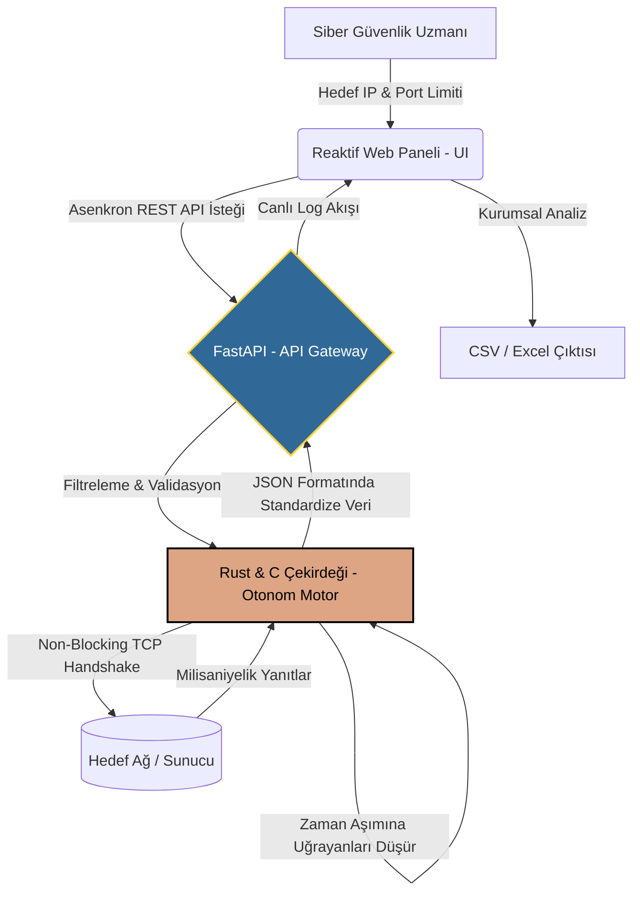

<div align="center">

# 🦅 ReconClaw V2.0 
### Otonom Zafiyet Keşif & Asenkron Port Tarama Motoru

<br>

<p align="center">
  
  
  
  
</p>

<p align="center">
  
  
  
  
</p>

*Klasik terminal betiklerini unutun. ReconClaw; gücünü asenkron mikroservis mimarisinden, hızını düşük seviyeli dillerden alan ve modern reaktif web arayüzü ile son kullanıcıya hitap eden kurumsal düzeyde bir siber istihbarat ürünüdür.*

</div>

---

## 📑 İçindekiler
1. [Teknoloji Yığını & Sistem Ağırlığı](#-teknoloji-yığını--sistem-ağırlığı-tech-stack)
2. [Sistem Mimarisi & Veri Akışı](#-sistem-mimarisi--veri-akışı-workflow)
3. [Algoritmik Çekirdek: Kaputun Altında Ne Var?](#-algoritmik-çekirdek-kaputun-altında-ne-var)
4. [Öne Çıkan Kurumsal Özellikler](#-v20-öne-çıkan-kurumsal-özellikler)
5. [Kurulum & Operasyon](#-kurulum--operasyonu-başlatma)
6. [Gelecek Yol Haritası (Roadmap)](#-gelecek-yol-haritası-roadmap)

---

## 📊 Teknoloji Yığını & Sistem Ağırlığı (Tech Stack)

Sistemin modüler yapısı, maksimum performans ve stabilite için farklı dillerin en güçlü yanları kullanılarak, darboğaz (bottleneck) yaratmayacak şekilde tasarlanmıştır:

```text
[█████████░] 45% | Rust (Core Engine)   : Asenkron ağ paketleme, Non-blocking I/O
[██████░░░░] 30% | Python (FastAPI)     : API Gateway, İstek doğrulama, JSON Handler
[███░░░░░░░] 15% | C (Memory/Low-Level) : Sistem kaynak yönetimi, bellek optimizasyonu
[██░░░░░░░░] 10% | Vanilla JS (UI/UX)   : Reaktif neon arayüz, asenkron DOM manipülasyonu
```

---

## ⚙️ Sistem Mimarisi & Veri Akışı (Workflow)

Staj ve sektörel projelerde genellikle tek boyutlu betikler yazılır. ReconClaw ise baştan uca bir **Yazılım Geliştirme Döngüsü (SDLC)** düşünülerek tasarlandı. Sistem, birbirinden izole çalışan ancak asenkron haberleşen katmanlardan oluşur:



---

## 🧠 Algoritmik Çekirdek: Kaputun Altında Ne Var?

ReconClaw geleneksel Nmap tarzı yavaş `for` döngüleri yerine **Event-Driven (Olay Güdümlü)** bir yapı kullanır:

*   **Green Threads:** Rust ve Tokio çalışma zamanı (runtime), işletim sistemini darboğaza sokmadan binlerce hafif iş parçacığı oluşturarak eşzamanlı sorgu atar. C dili tabanlı alt seviye bellek yönetimi sayesinde tarama sırasında RAM sızıntıları (Memory Leak) önlenir.
*   **Graceful Drop (Anında Düşürme):** `Connection Refused` dönen veya zaman aşımına uğrayan hedefler anında düşürülür (drop), böylece ağda gereksiz trafik (noise) yaratılmaz ve işlemci yorulmaz.
*   **Mikroservis İzolasyonu:** Ön yüz ile motor arasına çekilen FastAPI duvarı, olası "Command Injection" zafiyetlerini engelleyerek güvenli bir veri geçidi sağlar. Rust'ın ilettiği ham ağ paketlerini süzerek JSON nesnelerine dönüştürür.

---

## 🚀 V2.0 Öne Çıkan Kurumsal Özellikler

-   ⚡ **Otonom Asenkron Hız:** Hedefin durumuna ve ağın gecikmesine (latency) göre tarama yoğunluğunu dinamik ayarlayan çekirdek algoritma.
-   🌐 **Canlı Web Terminali (UI/UX):** İşlemlerin arka planda gizlenmediği, "Canlı Terminal İmleci" efekti ve radar animasyonlarıyla kullanıcıya anlık bildirim sağlayan interaktif neon kontrol paneli.
-   📊 **Kurumsal Raporlama (CSV Export):** Sızma testi (PenTest) sonrası elde edilen açık port verilerini, tek tıkla Excel/CSV formatında kurumsal analize uygun şekilde indirme modülü.
-   🛡️ **Graceful Degradation (Zırhlı Mimari):** Geçersiz IP veya ulaşılamayan domain girişlerinde sistemi çökertmeyen, kullanıcıya anında temiz log döndüren hata yakalama (Try-Catch) mimarisi.

---

## 💻 Kurulum & Operasyonu Başlatma

Sistemi kendi ortamınızda (Kali Linux / Ubuntu / macOS) izole bir şekilde ayağa kaldırmak için aşağıdaki adımları izleyin:

```bash
# 1. Kaynak Kodları Klonlayın
git clone [https://github.com/Pireburak/ReconClaw.git](https://github.com/Pireburak/ReconClaw.git)
cd ReconClaw/ai-brain

# 2. Gerekli API Kütüphanelerini Yükleyin
pip install fastapi uvicorn

# 3. ReconClaw Gateway'i Ateşleyin
uvicorn main:app --reload
```

> 💡 **Operasyonel Not:** Sunucu başarıyla ayağa kalktığında tarayıcınızdan `http://127.0.0.1:8000` adresine giderek operasyon paneline erişebilirsiniz. Hedef IP'yi girin, taramayı başlatın ve arkanıza yaslanın!

---

## 🗺️ Gelecek Yol Haritası (Roadmap)

Bir ürün asla bitmez, sadece evrimleşir. ReconClaw'un gelecek mimari planlaması:

- [x] Temel TCP Port Taraması (V1.0)
- [x] Asenkron Rust Motoru, C Bellek Optimizasyonu, Python API (V2.0)
- [x] Kurumsal Veri Analizi İçin Tek Tıkla CSV Dışa Aktarımı ve Neon UI (V2.0)
- [ ] Otonom Zafiyet Veritabanı (CVE) Eşleştirmesi (V3.0)
- [ ] Dağıtık Mimari: Docker Container Desteği ve CI/CD Pipeline (V4.0)

---

## ⚖️ Yasal Uyarı (Disclaimer)

*Bu araç, siber güvenlik uzmanları ve araştırmacılar için tamamen eğitim ve yetkili sızma testleri (White-Hat) amacıyla geliştirilmiştir. ReconClaw'un yetkisiz sistemler üzerinde kullanılması yasa dışıdır. Ortaya çıkabilecek olumsuz durumlarda tüm yasal sorumluluk son kullanıcıya aittir.*

---

<div align="center">
  <b>👨‍💻 Geliştirici & Sistem Mimarı: Burak Özdemir</b> <br>
  <i>Siber Güvenlik Araştırmacısı | Bilişim Güvenliği Teknolojisi, İstinye Üniversitesi</i>
</div>
