<p align="center"></p>

<h1 align="center">🦝 ReconClaw v6.1 Aurora</h1>

<p align="center"><b>Asenkron Ağ Keşfi, Port Tarama ve Risk Analiz Platformu</b><br>
<i>Maskeli gözlerle keşfeder, pençesiyle açıkları yakalar.</i></p>

<p align="center">


<br>


</p>

<p align="center">
<a href="#-60-saniyede-başla">Hızlı Başlangıç</a> •
<a href="#️-ekran-turu">Ekran Turu</a> •
<a href="#️-nasıl-çalışır">Nasıl Çalışır</a> •
<a href="#-api">API</a> •
<a href="#-alan-adında-yayınlama-https">Yayınlama</a> •
<a href="#-neden-rakun">Maskot</a> •
<a href="#-sorun-giderme">Sorun Giderme</a> •
<a href="#️-yol-haritası">Yol Haritası</a>
</p>

<p align="center">
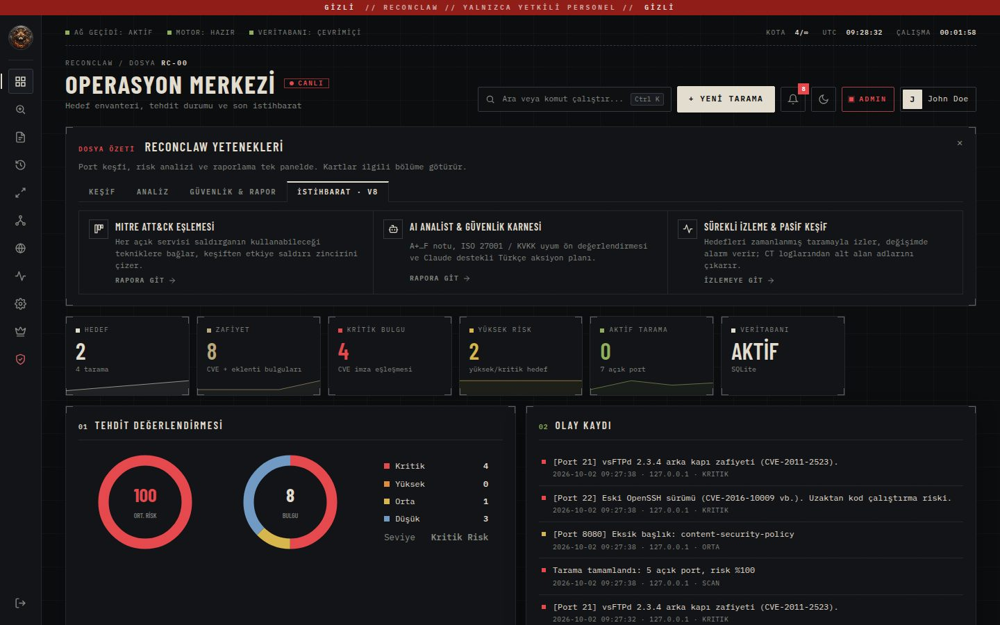
</p>

> [!IMPORTANT]
> ReconClaw yalnızca **sahibi olduğunuz** veya **yazılı izin aldığınız** sistemlerde kullanılmalıdır. İzinsiz port taraması Türkiye'de TCK 243–245 kapsamında suç teşkil edebilir. Ayrıntılar için [Yasal Uyarı](#️-yasal-uyarı) bölümüne bakın.

---

## 📑 İçindekiler

<details>
<summary><b>Tüm başlıkları göster</b></summary>

- [ReconClaw Nedir?](#-reconclaw-nedir)
- [60 Saniyede Başla](#-60-saniyede-başla)
- [Ekran Turu](#️-ekran-turu)
  - [Erişim Terminali (Giriş)](#1-erişim-terminali-giriş)
  - [Operasyon Merkezi](#2-operasyon-merkezi)
  - [Yeni Tarama: Radar ve Terminal](#3-yeni-tarama-radar-ve-terminal)
  - [Hedef Dosyası](#4-hedef-dosyası)
  - [Karşılaştırma](#5-karşılaştırma)
  - [Ağ Krokisi](#6-ağ-krokisi)
  - [Arşiv](#7-arşiv)
  - [Komut Paleti ve Kısayollar](#8-komut-paleti-ve-kısayollar)
  - [Bildirimler](#9-bildirimler)
  - [Ayarlar](#10-ayarlar)
  - [PDF Rapor](#11-pdf-rapor)
  - [Kâğıt Tema ve Vurgu Renkleri](#12-kâğıt-tema-ve-vurgu-renkleri)
  - [Telefon](#13-telefon)
- [Abonelik Planları](#-abonelik-planları)
- [Nasıl Çalışır?](#️-nasıl-çalışır)
- [Risk Değerlendirme Modeli](#-risk-değerlendirme-modeli)
- [Eklentiler](#-eklentiler)
- [API](#-api)
- [Yapılandırma (.env)](#️-yapılandırma-env)
- [Alan Adında Yayınlama (HTTPS)](#-alan-adında-yayınlama-https)
- [Güvenlik](#️-güvenlik)
- [Neden Rakun?](#-neden-rakun)
- [Sürüm Geçmişi](#-sürüm-geçmişi)
- [Proje Yapısı](#-proje-yapısı)
- [Veritabanı](#-veritabanı)
- [Testler](#-testler)
- [Sorun Giderme](#-sorun-giderme)
- [Sunum Rehberi](#-sunum-rehberi)
- [Yol Haritası](#️-yol-haritası)
- [Yasal Uyarı](#️-yasal-uyarı)

</details>

---

## 🦝 ReconClaw Nedir?

ReconClaw; **yetkili** ağ keşfi (reconnaissance), port analizi, servis tespiti ve ön güvenlik değerlendirmesi için geliştirilmiş, web arayüzlü bir siber güvenlik aracıdır. Bir hedefi verirsiniz; ReconClaw portlarını saniyeler içinde yoklar, açık servislerin sürümünü yakalar, bilinen zafiyetlerle eşleştirir, bir **risk skoru** hesaplar ve ne yapmanız gerektiğini Türkçe olarak söyler. Hepsi, bir istihbarat dosyası gibi tasarlanmış tek bir panelde.

| | Ne yapar? | Nasıl? |
|---|-----------|--------|
| ⚡ | **Hızlı keşif** | Asenkron TCP motoru yüzlerce portu aynı anda, eşzamanlılık sınırıyla yoklar |
| 🔍 | **Sürüm tespiti** | Banner grabbing ile servisin kendini tanıttığı satırı yakalar (SSH, FTP, HTTP…) |
| 🔴 | **Zafiyet eşleştirme** | Banner'ları CVE imzalarıyla karşılaştırır (vsFTPd 2.3.4, eski OpenSSH, Apache 2.4.49…) |
| 🧩 | **Derin kontrol** | Eklentiler HTTP güvenlik başlıklarını ve TLS sertifikalarını denetler |
| 🧠 | **Risk skoru** | Servis kritikliği + CVE + eklenti bulgularından 0–100 arası skor |
| ✅ | **Öneri** | Her bulgu için somut adım: "MySQL'i dış ağa kapat", "SFTP'ye geç"… |
| ⇄ | **Değişim takibi** | Aynı hedefin iki taramasını karşılaştırır: açılan / kapanan portlar, çözülen bulgular |
| 🖨️ | **Raporlama** | GİZLİ damgalı PDF rapor, CSV ve JSON dışa aktarım |
| 🔐 | **Çok kullanıcılı** | E-posta veya Google / GitHub / Microsoft / Apple ile giriş; herkes yalnızca kendi taramalarını görür |
| 🌐 | **Yayına hazır** | Docker + Caddy ile alan adında tek komutla otomatik HTTPS |

**Kimler için?** Ağını tanımak isteyen sistem yöneticileri, siber güvenlik öğrencileri, CTF / lab ortamlarında çalışanlar ve yetkili sızma testi öncesinde hızlı bir ön değerlendirme isteyenler için.

---

## 🚀 60 Saniyede Başla

> Gereksinim: **Python 3.10+** ve **git**. (Kali Linux, Ubuntu, macOS ve Windows'ta çalışır.)

```bash
# 1) Projeyi indir
git clone https://github.com/Pireburak/ReconClaw.git
cd ReconClaw

# 2) Sanal ortamı kur ve bağımlılıkları yükle
python3 -m venv .venv
source .venv/bin/activate          # Windows: .venv\Scripts\activate
pip install -r requirements.txt

# 3) Ayar dosyasını oluştur (varsayılanlarla da çalışır)
cp .env.example .env

# 4) Çalıştır
python main.py
```

Tarayıcıda **http://127.0.0.1:8000** adresini açın, ardından:

1. **KAYIT OL** sekmesinden bir operatör hesabı açın.
2. Sol raydaki 🔍 ikonuna (veya `1` tuşuna) basıp **Yeni Tarama** sayfasına geçin.
3. Hedefe `scanme.nmap.org` yazın. Bu, Nmap'in tarama için resmi olarak izin verdiği test sunucusudur.
4. **TARAMAYI BAŞLAT** deyin ve radarı izleyin. 🦝

> [!TIP]
> Sonraki açılışlarda yalnızca şu üç satır yeterlidir:
> ```bash
> cd ~/ReconClaw && source .venv/bin/activate && python main.py
> ```

---

## 🖼️ Ekran Turu

> Görüntüler yerel bir test laboratuvarında (127.0.0.1 üzerinde kasıtlı olarak eski sürümlü sahte servisler) alınmıştır.

### 1. Erişim Terminali (Giriş)

<p align="center">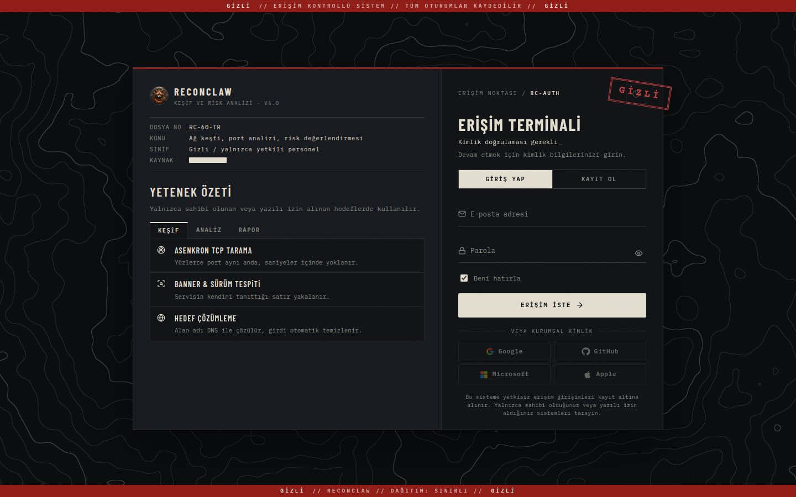</p>

Giriş ekranı, açık bir istihbarat dosyası gibi tasarlandı:

- **Solda dosya künyesi:** dosya numarası, konu, sınıf ve karartılmış (██████) bir "Kaynak" satırı. Altında **Keşif / Analiz / Rapor** sekmeli yetenek özeti.
- **Sağda kimlik doğrulama:** kayan etiketli e-posta ve parola alanları, parolayı göster/gizle, kayıt modunda **parola gücü göstergesi**.
- **Sosyal giriş:** Google, GitHub, Microsoft ve Apple. Yapılandırılmamış olanlar pasif görünür.
- **Arka plan:** WebGL ile çizilen, yavaşça kayan bir **topoğrafik harita**. Farenin altında bir tepe oluşur. WebGL yoksa düz arka plana düşer; sekme arka plandayken çizim durur.
- Köşede kırmızı **GİZLİ** damgası, üstte ve altta sınıflandırma bandı.

<details>
<summary>📄 Kâğıt temada erişim terminali</summary>
<p align="center">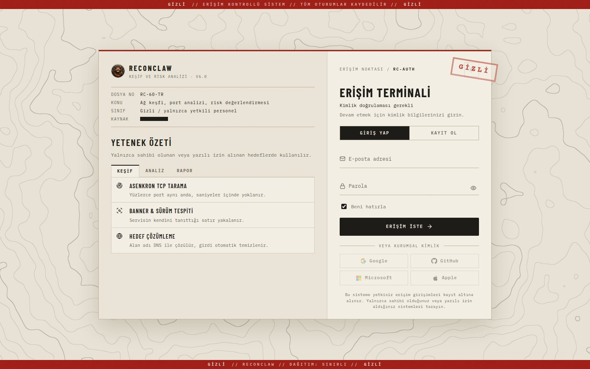</p>
</details>

### 2. Operasyon Merkezi

<p align="center"></p>

Girişten sonra açılan genel bakış ekranı, tüm taramalarınızın özetidir:

| Bölüm | Gösterdiği |
|-------|------------|
| **Yetenek özeti** | Keşif / Analiz / Güvenlik & Rapor sekmeli kartlar. Her kart ilgili sayfaya götürür; ✕ ile gizlenir |
| **İstatistik kartları** | Hedef, zafiyet, kritik bulgu, yüksek riskli hedef, aktif tarama ve veritabanı durumu. Rakamlar sayarak artar, kartın altında mini trend çizgisi (sparkline) vardır |
| **01 Tehdit değerlendirmesi** | Ortalama risk halkası + şiddete göre bulgu dağılımı (kritik / yüksek / orta / düşük) |
| **02 Olay kaydı** | En yeni CVE eşleşmeleri ve yüksek/orta bulgular; tıklayınca ilgili rapor açılır |
| **03 Risk eğilimi** | Son 20 taramanın risk skoru (çizgi) ve bulgu sayısı (sütun) |
| **04 En çok açık port** | Hedefleriniz arasında en sık açık bulunan portlar |
| **05 Operasyon takvimi** | GitHub tarzı, son 1 yılın gün gün tarama yoğunluğu |
| **06 Hedef risk tablosu** | Her hedefin en güncel taraması, riske göre sıralı |

Üstteki **durum satırı** ağ geçidi, tarama motoru ve veritabanı durumunu, UTC saatini ve sunucunun çalışma süresini gösterir. Panel açıkken her 15 saniyede bir kendini yeniler.

### 3. Yeni Tarama: Radar ve Terminal

<p align="center">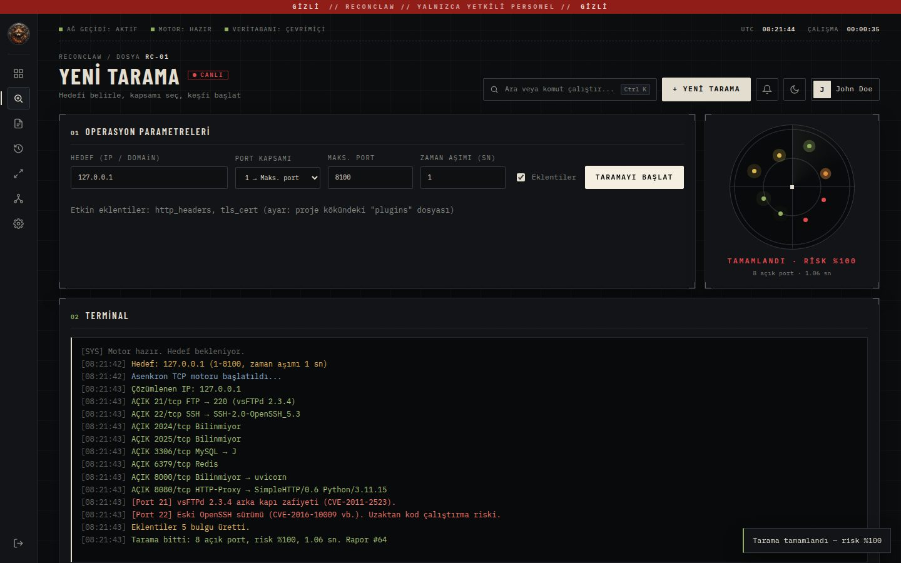</p>

- **Hedef:** IP adresi veya alan adı. `https://site.com/yol` gibi girdiler otomatik temizlenir.
- **Port kapsamı:** *Yaygın portlar* (güvenlik açısından kritik 27 port) ya da *1 → Maks. port* (65535'e kadar).
- **Zaman aşımı** (0.2–5 sn) ve **eklentiler** açık/kapalı.
- Son taranan hedefler altta **tek tıkla yeniden tarama** çipleri olarak durur.
- Tarama sürerken **radar** döner ve geçen süreyi gösterir. Bitince her açık port, risk rengine göre radarda parlayan bir nokta olarak belirir.
- **Terminal** her adımı zaman damgasıyla yazar: DNS çözümü, açık portlar, banner'lar, CVE uyarıları ve eklenti bulguları.

### 4. Hedef Dosyası

<p align="center">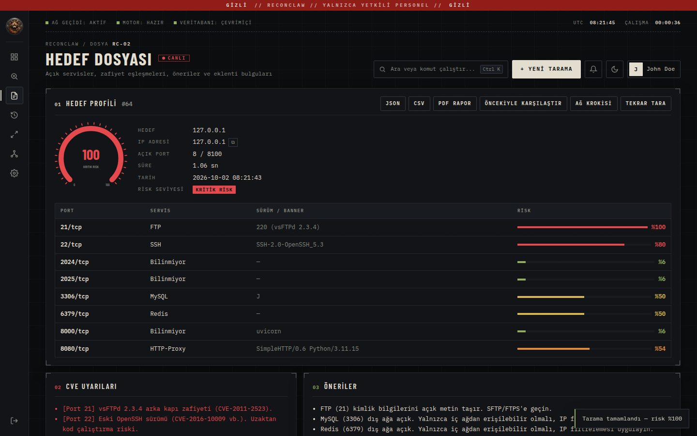</p>

Bir taramanın tam raporu:

- **Risk göstergesi:** 270°'lik, işaret çizgili, dolarak gelen yay ve seviye etiketi
- **Künye:** hedef, IP (tek tıkla kopyala), açık port / taranan port, süre, tarih
- **Port tablosu:** servis, sürüm/banner ve her port için animasyonlu risk çubuğu
- **Dışa aktarma:** JSON · CSV · PDF rapor · Öncekiyle karşılaştır · Ağ krokisi · Tekrar tara

<p align="center">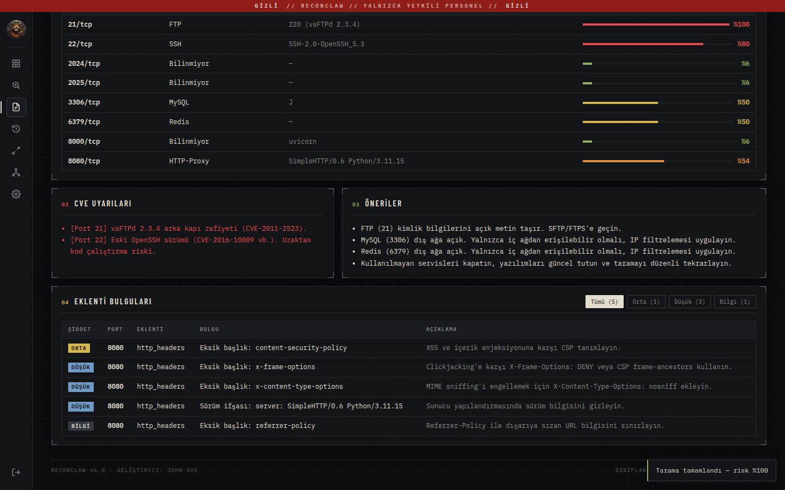</p>

Aşağıda **CVE uyarıları**, **öneriler** ve **eklenti bulguları** yer alır. Bulgular şiddete göre tek tıkla süzülebilir (Tümü / Orta / Düşük / Bilgi).

### 5. Karşılaştırma

<p align="center">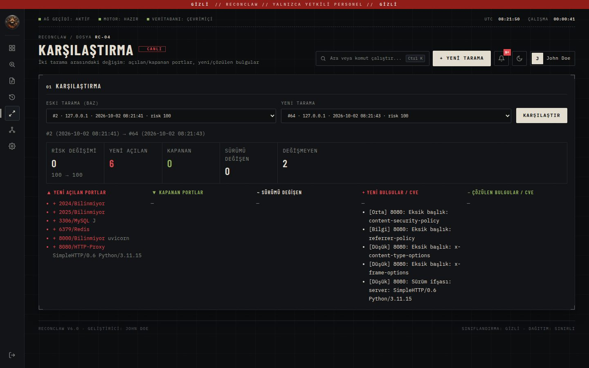</p>

Aynı hedefin iki taramasını yan yana koyar ve **ne değişti** sorusunu cevaplar:

- Risk skorundaki değişim (artış kırmızı, düşüş yeşil)
- **Yeni açılan** ve **kapanan** portlar
- **Sürümü değişen** servisler (ör. `OpenSSH_5.3` → `OpenSSH_9.6`)
- **Yeni** ve **çözülen** bulgular / CVE'ler

Hedef dosyasındaki **ÖNCEKİYLE KARŞILAŞTIR** butonu ya da arşivde iki kutuyu işaretlemek yeterlidir. Farklı hedefler seçilirse uyarı verir.

### 6. Ağ Krokisi

<p align="center">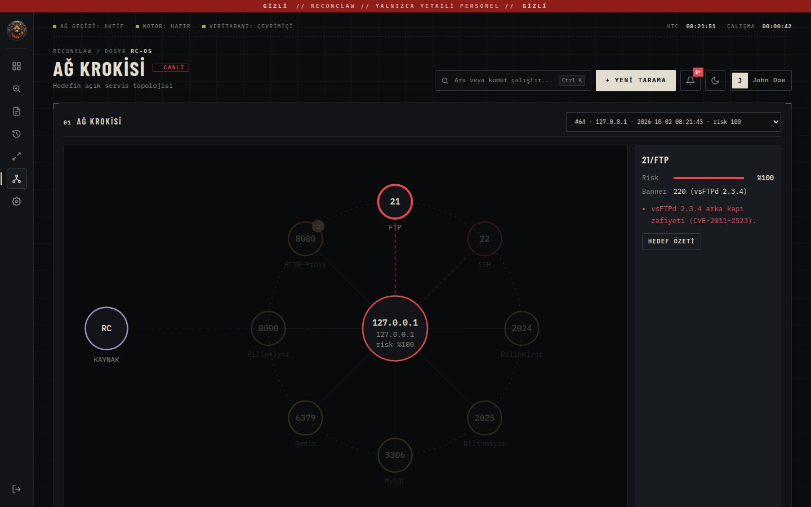</p>

Hedefi merkeze, açık portlarını etrafına yerleştiren bir topoloji çizimi:

- Düğüm çerçeve rengi = portun risk seviyesi
- **Kesikli kırmızı hat** = o portta CVE veya yüksek şiddetli bulgu var
- Düğüm üzerindeki rozet = bulgu sayısı
- Bir porta tıklayınca diğerleri solar, sağ panelde **banner, CVE ve bulgular** açılır. `Enter` ile klavyeden de gezilebilir.

### 7. Arşiv

<p align="center">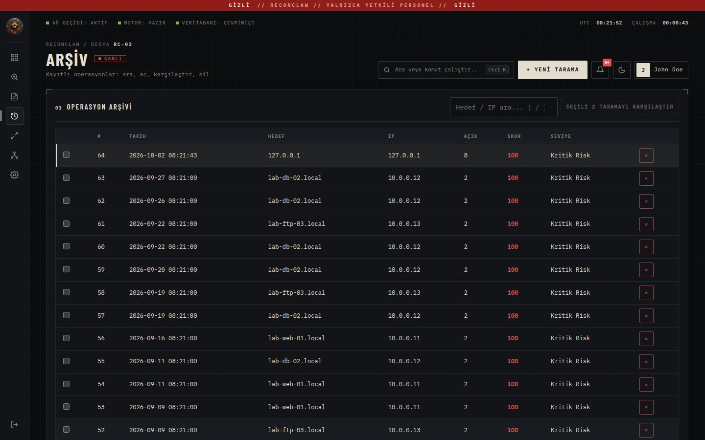</p>

Tüm taramalar en yeniden eskiye listelenir. Hedef veya IP'ye göre **anlık arama** yapılabilir (`/` tuşu). Satıra tıklayınca rapor açılır, iki kutu işaretlenince **karşılaştırılır**, ✕ ile tek tek silinir.

### 8. Komut Paleti ve Kısayollar

<p align="center">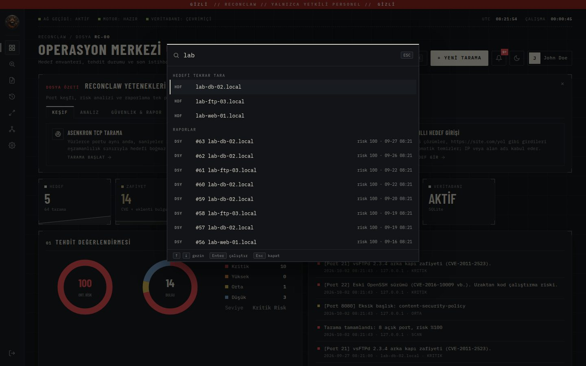</p>

**Ctrl+K** ile açılan komut paleti, fareye dokunmadan her şeyi yapmanızı sağlar: bölümlere gitmek, temayı veya vurgu rengini değiştirmek, son raporu PDF/CSV almak, eski raporları açmak, bir hedefi tek tuşla yeniden taramak. Palete listede olmayan bir hedef yazıp `Enter`'a basarsanız doğrudan tarama sayfasına gider.

| Kısayol | İşlev |
|---------|-------|
| `Ctrl` + `K` | Komut paleti |
| `0` … `7` | Bölümler arasında geçiş (0 = Operasyon Merkezi … 7 = Abonelik) |
| `N` | Yeni tarama |
| `T` | Karanlık / kâğıt tema |
| `/` | Arşivde ara |
| `?` | Kısayol listesi |
| `Esc` | Açık pencereyi kapat |

### 9. Bildirimler

<p align="center">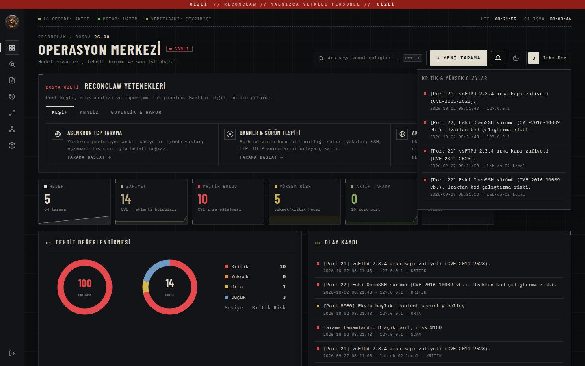</p>

Üstteki zil, **görülmemiş kritik ve yüksek** olayların sayısını gösterir. Tıklayınca liste açılır ve sayaç sıfırlanır; bir olaya tıklayınca ilgili rapor açılır.

### 10. Ayarlar

<p align="center">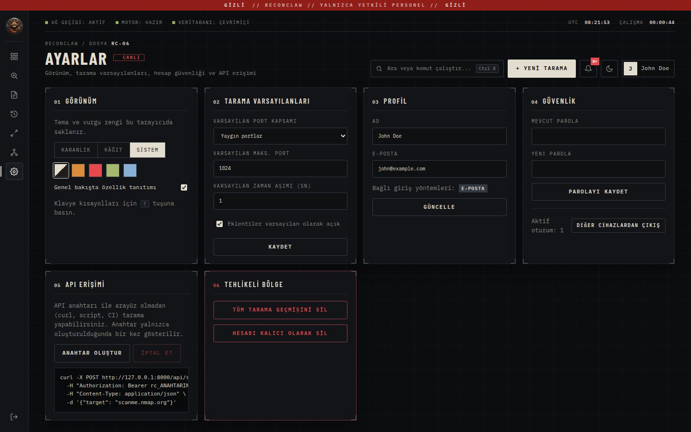</p>

| Kart | İçerik |
|------|--------|
| **Görünüm** | Karanlık / Kâğıt / Sistem teması, 5 vurgu rengi, özellik tanıtımını aç/kapa |
| **Tarama varsayılanları** | Port kapsamı, maks. port, zaman aşımı, eklentiler (tarayıcıda saklanır) |
| **Profil** | Ad, e-posta, bağlı giriş yöntemleri |
| **Güvenlik** | Parola değiştir / belirle, **diğer cihazlardan çıkış** |
| **API erişimi** | Kişisel API anahtarı oluştur / iptal et, hazır `curl` örneği |
| **Tehlikeli bölge** | Tüm tarama geçmişini sil, hesabı kalıcı olarak sil |

### 11. PDF Rapor

<p align="center">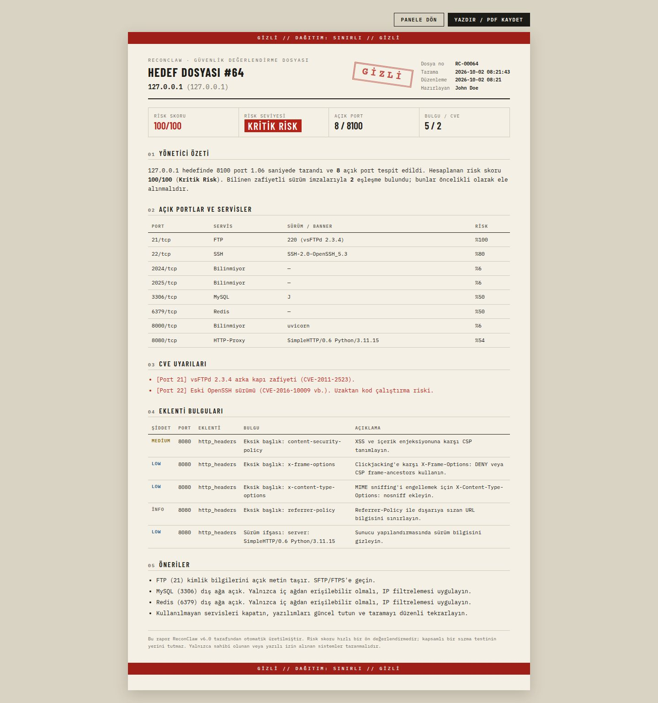</p>

Her tarama, yazdırılabilir bir **güvenlik değerlendirme dosyasına** dönüşür: dosya numarası, **GİZLİ** damgası, sınıflandırma bantları, yönetici özeti, port tablosu, CVE uyarıları, eklenti bulguları ve öneriler. Tarayıcıdan **Yazdır → PDF olarak kaydet** ile dosya hâline gelir. Teslim edilecek ödev ve raporlar için idealdir.

### 12. Kâğıt Tema ve Vurgu Renkleri

<p align="center">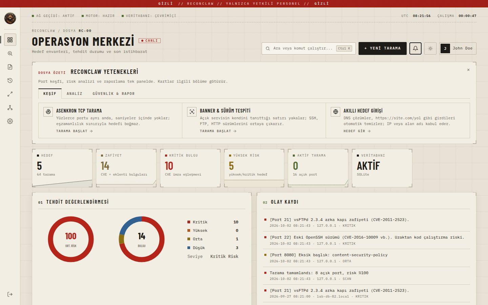</p>

`T` tuşuyla karanlık tema, sararmış bir **kâğıt dosyaya** dönüşür. Ayarlar'dan 5 vurgu rengi seçilebilir:

| Renk | Karanlık | Kâğıt |
|------|----------|-------|
| **Mürekkep** (varsayılan) | Kâğıt beyazı | Siyah mürekkep |
| **Bakır** | `#d98a3a` | `#9c4a14` |
| **Sinyal kırmızısı** | `#e5484d` | `#b42318` |
| **Haki** | `#a3b86c` | `#4f6b2f` |
| **Çelik mavisi** | `#86aed4` | `#2f5f8f` |

Tema ve renk tercihi tarayıcıda saklanır. Sayfa açılırken erken yüklendiği için yanlış renkte yanıp sönme olmaz.

### 13. Telefon

<p align="center">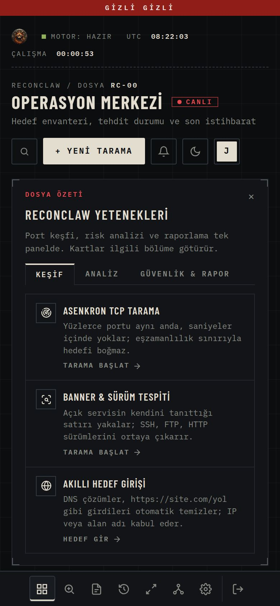</p>

Arayüz telefonda da tam çalışır: sol ikon rayı ekranın altına **sekme çubuğu** olarak iner, tablolar yatay kaydırılır, giriş ekranında form üste, dosya özeti alta geçer.

---

## 💳 Abonelik Planları

ReconClaw v6.1 ile **5 kademeli üyelik** sistemi geldi. Her yeni hesap **Free** planla başlar; sınırlar yalnızca arayüzde değil **sunucu tarafında** uygulanır (API ile de aşılamaz). Sınırı aşan bir istek `HTTP 402` döner ve arayüz kullanıcıyı **Abonelik** sayfasına yönlendirir.

<p align="center">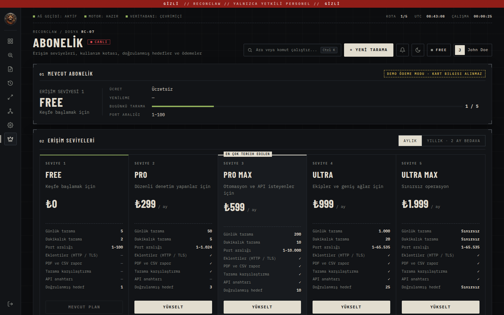</p>

| Özellik | 🆓 Free | ⭐ Pro | 💎 Pro Max | 🚀 Ultra | 👑 Ultra Max |
|---------|:------:|:-----:|:---------:|:-------:|:-----------:|
| **Aylık fiyat** | **₺0** | **₺299** | **₺599** | **₺999** | **₺1.999** |
| Yıllık fiyat *(2 ay bedava)* | ₺0 | ₺2.990 | ₺5.990 | ₺9.990 | ₺19.990 |
| Günlük tarama | 5 | 50 | 200 | 1.000 | ∞ |
| Dakikalık tarama | 2 | 5 | 10 | 20 | ∞ |
| Port aralığı | 1–100 | 1–1024 | 1–10000 | 1–65535 | 1–65535 |
| HTTP / TLS eklentileri | — | ✅ | ✅ | ✅ | ✅ |
| PDF / CSV rapor | — | ✅ | ✅ | ✅ | ✅ |
| Tarama karşılaştırma | — | ✅ | ✅ | ✅ | ✅ |
| API anahtarı | — | — | ✅ | ✅ | ✅ |
| Doğrulanmış hedef | 1 | 3 | 10 | 25 | ∞ |

- **Günlük kota** ayrı bir sayaçta tutulur: tarama silmek hakkı geri vermez.
- Ücretli planın süresi dolunca hesap otomatik olarak **Free** sınırlarına döner; API anahtarı da çalışmayı bırakır.
- Üst barda planı gösteren rozet ve `KOTA 3/5` sayacı bulunur; kilitli düğmelerde **PRO** etiketi görünür.

<table>
<tr>
<td width="50%">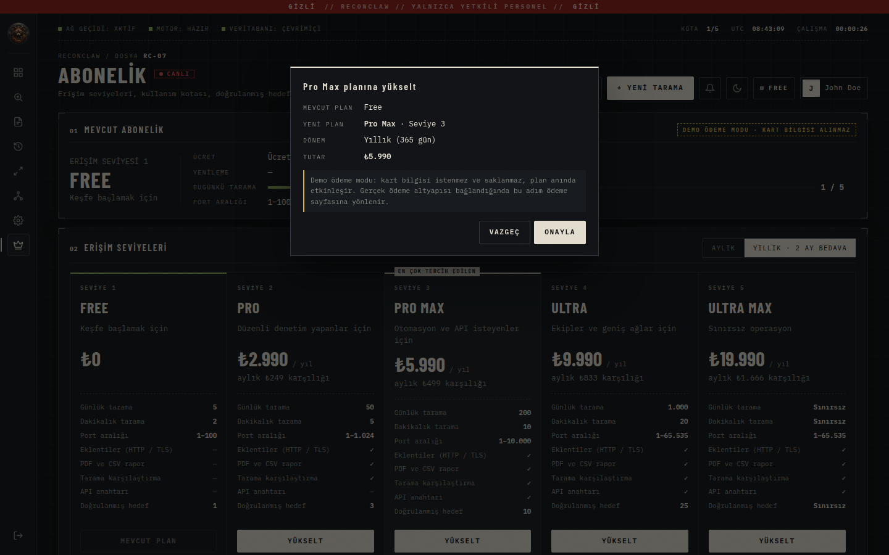</td>
<td width="50%">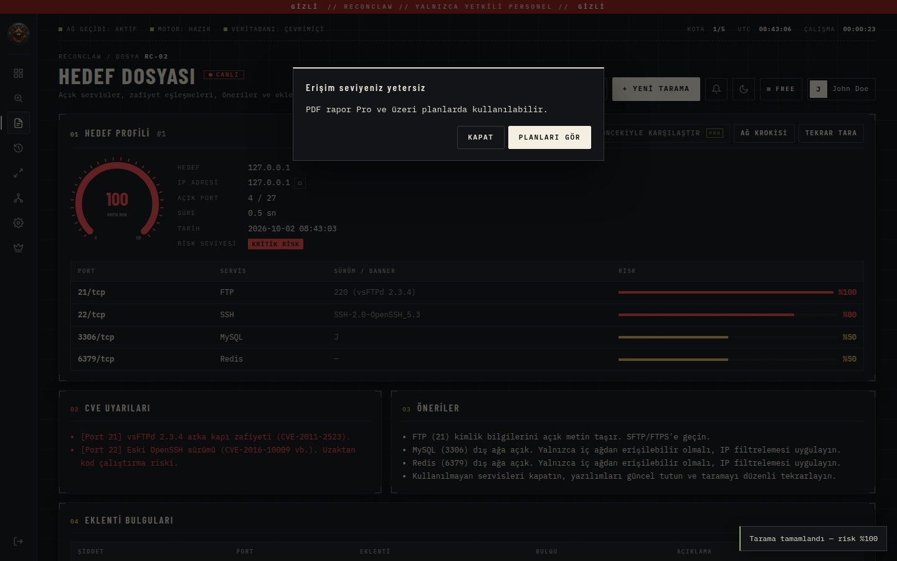</td>
</tr>
<tr>
<td align="center"><sub>Demo ödeme onayı</sub></td>
<td align="center"><sub>Kilitli özellikte yükseltme penceresi</sub></td>
</tr>
</table>

> [!NOTE]
> Ödeme şimdilik **demo modundadır**: kart bilgisi istenmez ve saklanmaz, plan anında etkinleşir ve `payments` tablosuna `demo` durumlu bir kayıt düşülür. Gerçek ödeme altyapısı (iyzico, Lemon Squeezy vb.) `core/plans.py` içindeki `checkout()` fonksiyonunun yerine bağlanacak şekilde tasarlandı.

### 🎯 Hedef sahipliği doğrulama

İnternete açık bir sunucuda kimsenin başkasına ait sistemi taramaması için `.env` dosyasında `REQUIRE_TARGET_VERIFICATION=true` yapın. Bu durumda yalnızca sahipliği kanıtlanmış hedefler (ve herkese açık test sunucusu `scanme.nmap.org`) taranabilir. **Abonelik → Doğrulanmış hedefler** bölümünden hedef ekleyin ve size verilen anahtarı iki yoldan biriyle yayınlayın:

| Yöntem | Yapılacak |
|--------|-----------|
| **DNS** | Alan adına `TXT` kaydı: `reconclaw-verify=<anahtar>` |
| **Dosya** | `https://<hedef>/.well-known/reconclaw-verify.txt` adresine anahtarı içeren dosya |

Ardından **DOĞRULA**'ya basın. DNS sorgusu DNS-over-HTTPS ile yapılır; iç ağ adresleri `ALLOW_PRIVATE_TARGETS=false` iken doğrulanamaz (SSRF koruması).

---

## ⚙️ Nasıl Çalışır?

Bir tarama isteği, arka planda şu yolu izler:

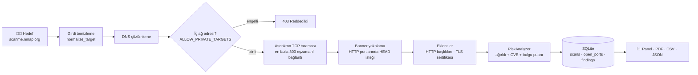
```mermaid
flowchart LR
    A[🧑‍💻 Hedef<br>scanme.nmap.org] --> B[Girdi temizleme<br>normalize_target]
    B --> C[DNS çözümleme]
    C --> D{İç ağ adresi?<br>ALLOW_PRIVATE_TARGETS}
    D -- engelli --> X[403 Reddedildi]
    D -- izinli --> E[Asenkron TCP taraması<br>en fazla 300 eşzamanlı bağlantı]
    E --> F[Banner yakalama<br>HTTP portlarında HEAD isteği]
    F --> G[Eklentiler<br>HTTP başlıkları · TLS sertifikası]
    G --> H[RiskAnalyzer<br>ağırlık + CVE + bulgu puanı]
    H --> I[(SQLite<br>scans · open_ports · findings)]
    I --> J[📊 Panel · PDF · CSV · JSON]
```

1. **Girdi temizleme:** `https://site.com:8080/yol` → `site.com`. Geçersiz ana bilgisayar adları 422 ile reddedilir.
2. **DNS:** Alan adı IPv4 adresine çözülür; çözülemezse 400 döner.
3. **İç ağ kontrolü:** Sunucu internete açıksa `ALLOW_PRIVATE_TARGETS=false` ile 127.0.0.1, 10.x, 192.168.x gibi adresler engellenir.
4. **Tarama:** Her port için `asyncio.open_connection` ile TCP bağlantısı denenir. Semafor, aynı anda en fazla 300 bağlantıya izin verir; böylece hem hızlı olur hem de hedef boğulmaz.
5. **Banner:** Açık porttan gelen ilk satır okunur. HTTP portlarında `HEAD /` gönderilip `Server:` başlığı alınır.
6. **Eklentiler:** Yalnızca ilgilendikleri açık portlarda, eşzamanlı çalışırlar. Biri hata verirse tarama bozulmaz.
7. **Risk analizi:** Servis ağırlıkları, CVE imza puanları ve eklenti bulgu puanları toplanır (en fazla 100). Öneriler üretilir.
8. **Kayıt:** Rapor, sahibi olan kullanıcıyla birlikte SQLite'a yazılır. Panel, istatistikleri bu kayıtlardan hesaplar.

<details>
<summary><b>🔐 Sosyal giriş (OAuth) akışı</b></summary>

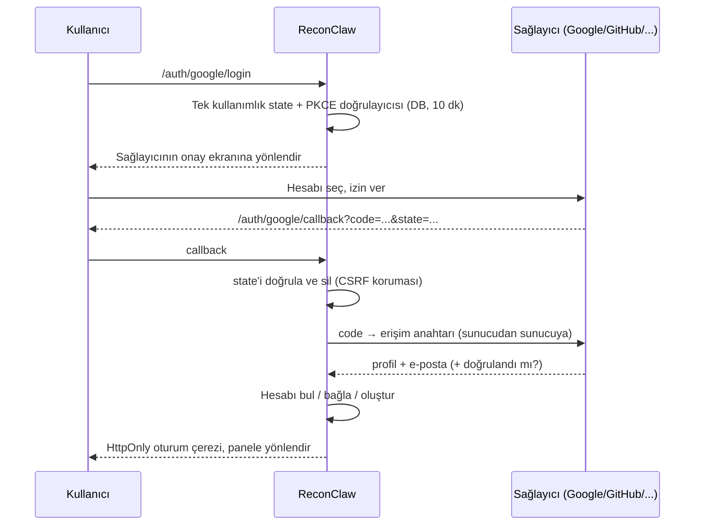
```mermaid
sequenceDiagram
    participant K as Kullanıcı
    participant R as ReconClaw
    participant S as Sağlayıcı (Google/GitHub/...)
    K->>R: /auth/google/login
    R->>R: Tek kullanımlık state + PKCE doğrulayıcısı (DB, 10 dk)
    R-->>K: Sağlayıcının onay ekranına yönlendir
    K->>S: Hesabı seç, izin ver
    S-->>K: /auth/google/callback?code=...&state=...
    K->>R: callback
    R->>R: state'i doğrula ve sil (CSRF koruması)
    R->>S: code → erişim anahtarı (sunucudan sunucuya)
    S-->>R: profil + e-posta (+ doğrulandı mı?)
    R->>R: Hesabı bul / bağla / oluştur
    R-->>K: HttpOnly oturum çerezi, panele yönlendir
```

Sosyal hesap, var olan bir e-posta hesabına **yalnızca sağlayıcı e-postayı doğrulamışsa** bağlanır. Böylece başkası aynı e-postayı yazarak hesabınızı ele geçiremez.
</details>

---

## 📊 Risk Değerlendirme Modeli

Her açık port, servisin kritikliğine göre bir **risk ağırlığı** taşır. Portun kendi riski `ağırlık × 2` (en fazla %100), hedefin toplam skoru ise tüm ağırlıkların toplamıdır (en fazla 100).

| Ağırlık | Servisler |
|:-------:|-----------|
| **25** | Telnet (23), SMB (445), MSSQL (1433), Oracle (1521), MySQL (3306), PostgreSQL (5432), Redis (6379), Elasticsearch (9200), MongoDB (27017) |
| **20** | NetBIOS (139), NFS (2049), RDP (3389), VNC (5900) |
| **15** | FTP (21), RPCbind (111), MS-RPC (135) |
| **10** | SSH (22), POP3 (110), IMAP (143), HTTP-Proxy (8080) |
| **5–8** | SMTP (25) 8 · DNS (53) 5 · HTTP (80) 5 · HTTPS-Alt (8443) 5 |
| **2–3** | HTTPS (443) 2 · IMAPS (993) 3 · POP3S (995) 3 · bilinmeyen port 3 |

**Ek puanlar:**

| Kaynak | Puan |
|--------|------|
| CVE imzası eşleşmesi | +25 … +50 (aşağıdaki tablo) |
| Eklenti bulgusu | Yüksek +15 · Orta +8 · Düşük +3 · Bilgi 0 |

| Risk Seviyesi  | Skor         | Durum     | Açıklama                                                                  |
| :------------- | :----------: | :-------: | ------------------------------------------------------------------------- |
| 🟢 Düşük Risk  | **0 – 25**   | Güvenli   | Kritik seviyede bir güvenlik riski bulunmamaktadır.                       |
| 🟡 Orta Risk   | **26 – 50**  | İzlenmeli | Yapılandırma iyileştirmeleri ve düzenli kontroller önerilir.              |
| 🟠 Yüksek Risk | **51 – 75**  | Riskli    | Açık servisler saldırı yüzeyini artırıyor; önlemler güçlendirilmelidir.   |
| 🔴 Kritik Risk | **76 – 100** | Kritik    | Kritik servisler veya bilinen zafiyetler tespit edildi; acil aksiyon alın. |

**Tanınan CVE imzaları:**

| Banner İmzası          | Zafiyet                                                | Ek puan |
| ---------------------- | ------------------------------------------------------ | :-----: |
| vsFTPd 2.3.4           | CVE-2011-2523 (arka kapı)                              | +50 |
| Apache 2.4.49 / 2.4.50 | CVE-2021-41773 / CVE-2021-42013 (Path Traversal & RCE) | +50 |
| OpenSSH 4.x – 6.x      | CVE-2016-10009 ve benzeri eski sürüm açıkları          | +30 |
| ProFTPD 1.3.0 – 1.3.5  | CVE-2015-3306 (mod_copy)                               | +30 |
| Microsoft-IIS 5 – 7    | Desteği bitmiş sürüm                                   | +25 |

**Örnek hesap:** `22/SSH (OpenSSH_5.3)` + `80/HTTP` + `3306/MySQL` açık bir hedef için → SSH 10 + CVE 30 + HTTP 5 + MySQL 25 = **70 → 🟠 Yüksek Risk**.

> **Not:** Risk skoru hızlı bir **ön değerlendirmedir**; kapsamlı bir sızma testinin veya zafiyet taramasının yerini tutmaz.

---

## 🧩 Eklentiler

Port taraması bittikten sonra eklentiler, ilgilendikleri açık portlarda ek kontroller yapar. Bulguların şiddetine göre (Yüksek +15, Orta +8, Düşük +3, Bilgi 0) ilgili portun ve hedefin risk skoru artar.

| Eklenti        | Portlar                          | Kontroller                                                                 |
|
---

## 🔌 API

Etkileşimli API dokümantasyonu (Swagger): **http://127.0.0.1:8000/docs**

Tüm `/api/*` uç noktaları oturum ister. API anahtarı **Pro Max** ve üzeri planlarda kullanılabilir. Tarayıcıda giriş çerezi kullanılır; script ve curl için **Ayarlar → API erişimi**'nden oluşturulan anahtar `Authorization: Bearer rc_...` başlığıyla gönderilir.

### `POST /api/scan`

```bash
curl -X POST http://127.0.0.1:8000/api/scan \
     -H "Authorization: Bearer rc_ANAHTARINIZ" \
     -H "Content-Type: application/json" \
     -d '{"target": "scanme.nmap.org"}'
```

| Alan       | Tip    | Zorunlu | Açıklama                                                     |
| ---------- | ------ | :-----: | ------------------------------------------------------------ |
| `target`   | string |   ✅    | IP adresi veya alan adı                                      |
| `max_port` | int    |   —     | Verilirse `1..max_port` taranır, verilmezse yaygın portlar   |
| `timeout`  | float  |   —     | Port başına bağlantı zaman aşımı (0.2 – 5 sn, varsayılan 1) |
| `plugins`  | bool   |   —     | Eklentileri çalıştır (varsayılan `true`)                     |

<details>
<summary>Örnek yanıt</summary>

```json
{
  "success": true,
  "scan_id": 12,
  "scan_time": "2026-09-25 10:15:42",
  "target": "example.com",
  "resolved_ip": "192.168.1.10",
  "scanned_ports": 27,
  "duration": 1.04,
  "total_open": 4,
  "overall_risk": 72,
  "risk_level": { "key": "high", "label": "Yüksek Risk" },
  "cve_alerts": [
    "[Port 22] Eski OpenSSH sürümü (CVE-2016-10009 vb.). Uzaktan kod çalıştırma riski."
  ],
  "recommendations": [
    "MySQL (3306) dış ağa açık. Yalnızca iç ağdan erişilebilir olmalı, IP filtrelemesi uygulayın.",
    "Kullanılmayan servisleri kapatın, yazılımları güncel tutun ve taramayı düzenli tekrarlayın."
  ],
  "findings": [
    { "plugin": "http_headers", "port": 80, "severity": "low", "title": "Sürüm ifşası: server: nginx/1.18.0", "detail": "Sunucu yapılandırmasında sürüm bilgisini gizleyin." }
  ],
  "analysis": [
    { "port": 22, "protocol": "TCP", "banner": "SSH-2.0-OpenSSH_5.3", "service": "SSH", "risk": 80 }
  ]
}
```
</details>
### Tüm uç noktalar

| Uç Nokta | Açıklama |
| -------- | -------- |
| `POST /api/scan` | Tarama başlat, tam raporu döndür |
| `GET /api/history?limit=20&q=` | Son taramaların özet listesi (`q` ile hedef/IP araması) |
| `GET /api/scans/{id}` | Kayıtlı bir taramanın tam raporu |
| `DELETE /api/scans/{id}` · `DELETE /api/scans` | Bir taramayı / tüm geçmişi sil |
| `GET /api/scans/{id}/csv` | Raporu CSV olarak indir (Excel formül enjeksiyonuna karşı temizlenmiş) |
| `GET /reports/{id}` | Yazdırılabilir / PDF'e kaydedilebilir rapor sayfası |
| `GET /api/compare?old=1&new=2` | İki tarama arasındaki fark |
| `GET /api/stats` | Panel istatistikleri, trend, olay kaydı, aktivite takvimi |
| `GET /api/plugins` | Eklentiler, çalıştıkları portlar ve etkin olup olmadıkları |
| `GET /api/me` · `PATCH /api/me` · `DELETE /api/me` | Profil bilgisi, ad güncelleme, hesabı silme |
| `POST /api/me/password` | Parola değiştir / belirle (diğer oturumları kapatır) |
| `POST /api/me/token` · `DELETE /api/me/token` | API anahtarı oluştur / iptal et |
| `POST /api/me/sessions/revoke` | Diğer cihazlardaki oturumları kapat |
| `POST /auth/register` · `POST /auth/login` · `POST /auth/logout` | E-posta ile kayıt, giriş, çıkış |
| `GET /auth/providers` | Hangi sosyal giriş yöntemlerinin açık olduğu |
| `GET /auth/{google\|github\|microsoft\|apple}/login` | Sosyal giriş |
| `GET /api/plans` | Plan kataloğu ve fiyatlar (oturum gerektirmez) |
| `GET /api/billing` | Mevcut plan, bitiş tarihi, bugünkü kullanım ve ödeme geçmişi |
| `POST /api/billing/checkout` | `{"plan": "pro", "period": "monthly\|yearly"}` ile plana geç (demo ödeme) |
| `POST /api/billing/cancel` | Aboneliği iptal et, Free plana dön |
| `GET /api/targets` · `POST /api/targets` | Doğrulama hedeflerini listele / ekle |
| `POST /api/targets/{id}/verify` · `DELETE /api/targets/{id}` | Hedefi DNS veya dosya ile doğrula / sil |
| `GET /api/health` | Sağlık kontrolü (oturum gerektirmez) |

<details>
<summary><b>🐍 Python ile kullanım örneği</b></summary>

```python
import httpx

API = "http://127.0.0.1:8000"
HEADERS = {"Authorization": "Bearer rc_ANAHTARINIZ"}

rapor = httpx.post(f"{API}/api/scan", headers=HEADERS,
                   json={"target": "scanme.nmap.org"}, timeout=120).json()

print(f"{rapor['target']} → risk %{rapor['overall_risk']} ({rapor['risk_level']['label']})")
for port in rapor["analysis"]:
    print(f"  {port['port']}/tcp  {port['service']:<12} {port['banner']}")
for uyari in rapor["cve_alerts"]:
    print("  ⚠", uyari)
```
</details>

---

## 🛠️ Yapılandırma (.env)

Tüm ayarlar ortam değişkenleri veya proje kökündeki `.env` dosyasıyla yapılır (`cp .env.example .env`). Gerçek ortam değişkenleri `.env`'den önceliklidir.

| Değişken | Varsayılan | Açıklama |
|----------|:----------:|----------|
| `PUBLIC_URL` | *(boş)* | Sitenin dış adresi, ör. `https://reconclaw.alanadiniz.com`. OAuth yönlendirmeleri buradan üretilir |
| `DOMAIN` | `localhost` | Docker/Caddy için alan adı (otomatik HTTPS sertifikası) |
| `HOST` / `PORT` | `127.0.0.1` / `8000` | `python main.py` ile çalışırken dinlenen adres |
| `COOKIE_SECURE` | `PUBLIC_URL` https ise açık | Oturum çerezi yalnızca HTTPS üzerinden gönderilir |
| `SESSION_DAYS` | `7` | "Beni hatırla" ile açılan oturumun ömrü (gün) |
| `ALLOW_SIGNUP` | `true` | Yeni kayıtlara izin ver. Kendi hesabınızı açtıktan sonra kapatabilirsiniz |
| `ALLOW_PRIVATE_TARGETS` | `true` | İç ağ adreslerinin taranması. **İnternete açık sunucuda `false` yapın** |
| `SCAN_RATE_LIMIT` | `0` | Plan sınırlarına ek, tüm kullanıcılar için dakikalık üst sınır (0 = kapalı, yalnızca plan sınırları) |
| `REQUIRE_TARGET_VERIFICATION` | `false` | Yalnızca sahipliği doğrulanmış hedefler taransın. **Herkese açık sunucuda `true` yapın** |
| `RECONCLAW_DB` | `data/reconclaw_v4.db` | Veritabanı dosyasının yolu |
| `GOOGLE_CLIENT_ID` / `_SECRET` | — | Google ile giriş |
| `GITHUB_CLIENT_ID` / `_SECRET` | — | GitHub ile giriş |
| `MICROSOFT_CLIENT_ID` / `_SECRET` | — | Microsoft ile giriş |
| `APPLE_CLIENT_ID`, `APPLE_TEAM_ID`, `APPLE_KEY_ID`, `APPLE_PRIVATE_KEY_PATH` | — | Apple ile giriş (.p8 anahtarı) |

> [!CAUTION]
> `.env` dosyası gizli anahtarlar içerir. **Asla GitHub'a yüklemeyin**; `.gitignore`'da zaten engellenmiştir.

---

## 🌐 Alan Adında Yayınlama (HTTPS)

Bir alan adı (ör. `alanadiniz.com`) ve bir sunucu (VPS) aldığınızda ReconClaw'ı tek komutla HTTPS üzerinden yayınlayabilirsiniz. [Caddy](https://caddyserver.com), Let's Encrypt'ten **ücretsiz SSL sertifikasını otomatik** alır ve yeniler.

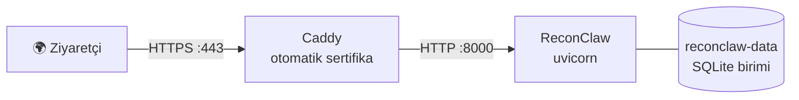
```mermaid
flowchart LR
    U[🌍 Ziyaretçi] -- HTTPS :443 --> C[Caddy<br>otomatik sertifika]
    C -- HTTP :8000 --> A[ReconClaw<br>uvicorn]
    A --- V[(reconclaw-data<br>SQLite birimi)]
```

```bash
# 1) DNS: alan adınızın (veya reconclaw.alanadiniz.com alt alanının) A kaydını sunucunun IP'sine yönlendirin
# 2) Sunucuda (Docker kurulu değilse: curl -fsSL https://get.docker.com | sh)
git clone https://github.com/Pireburak/ReconClaw.git && cd ReconClaw
cp .env.example .env
nano .env        # DOMAIN=reconclaw.alanadiniz.com
                 # PUBLIC_URL=https://reconclaw.alanadiniz.com
                 # ALLOW_PRIVATE_TARGETS=false   <- internete açık sunucuda mutlaka
docker compose up -d --build
```

Site birkaç dakika içinde `https://reconclaw.alanadiniz.com` adresinde açılır. İlk hesabınızı oluşturduktan sonra yabancıların kayıt olmasını istemiyorsanız `.env` içinde `ALLOW_SIGNUP=false` yapıp `docker compose up -d` ile yeniden başlatın.

> [!TIP]
> Öğrenciyseniz **GitHub Student Developer Pack** ile ücretsiz alan adı ve bulut sunucu kredisi alabilirsiniz.

### 🔐 Sosyal girişi açmak

Her sağlayıcıda bir "OAuth uygulaması" oluşturup verilen ID/secret değerlerini `.env` dosyasına yazmanız yeterli. Doldurulmayan sağlayıcıların butonu pasif görünür.

| Sağlayıcı | Nereden alınır | Yönlendirme (callback) adresi | `.env` |
|-----------|----------------|-------------------------------|--------|
| Google    | [Google Cloud Console → Credentials](https://console.cloud.google.com/apis/credentials) → *OAuth client ID (Web)* | `https://ALANADI/auth/google/callback` | `GOOGLE_CLIENT_ID`, `GOOGLE_CLIENT_SECRET` |
| GitHub    | [GitHub → Settings → Developer settings → OAuth Apps](https://github.com/settings/developers) | `https://ALANADI/auth/github/callback` | `GITHUB_CLIENT_ID`, `GITHUB_CLIENT_SECRET` |
| Microsoft | [Microsoft Entra → App registrations](https://entra.microsoft.com) (*Web* platformu) | `https://ALANADI/auth/microsoft/callback` | `MICROSOFT_CLIENT_ID`, `MICROSOFT_CLIENT_SECRET` |
| Apple     | [Apple Developer](https://developer.apple.com/account/resources) → *Services ID* + *Sign in with Apple* anahtarı (.p8). Ücretli geliştirici hesabı gerekir | `https://ALANADI/auth/apple/callback` | `APPLE_CLIENT_ID`, `APPLE_TEAM_ID`, `APPLE_KEY_ID`, `APPLE_PRIVATE_KEY_PATH` |

> 💡 Google ve GitHub, yerel geliştirmede `http://127.0.0.1:8000/auth/.../callback` adresini de kabul eder; alan adı almadan önce deneyebilirsiniz. Apple yalnızca HTTPS alan adlarıyla çalışır.

---

## 🛡️ Güvenlik

ReconClaw bir güvenlik aracı olduğu için kendi güvenliğine de özen gösterir:

| Alan | Önlem |
|------|-------|
| **Parolalar** | Tuzlu **scrypt** ile saklanır; düz metin asla veritabanına yazılmaz. Kullanıcı olmasa bile aynı sürede yanıt verilir (zamanlama saldırısı koruması) |
| **Oturumlar** | Rastgele anahtar, veritabanında yalnızca **SHA-256 özeti**; çerez `HttpOnly` + `SameSite=Lax` (+ HTTPS'te `Secure`). Parola değişince diğer cihazlardaki oturumlar kapanır |
| **API anahtarı** | `rc_` önekli, yalnızca bir kez gösterilir, veritabanında özeti tutulur, tek tıkla iptal edilir |
| **OAuth** | Tek kullanımlık `state` (CSRF), Google/Microsoft için **PKCE**; doğrulanmamış e-posta mevcut hesaba bağlanmaz |
| **Kötüye kullanım** | Giriş denemeleri IP başına 10 / 5 dk, taramalar kullanıcı başına `SCAN_RATE_LIMIT` / dk ile sınırlı |
| **SSRF / iç ağ** | `ALLOW_PRIVATE_TARGETS=false` ile ziyaretçilerin sunucunuzun iç ağını taraması engellenir |
| **Veri izolasyonu** | Her kullanıcı yalnızca kendi taramalarını görür, siler ve karşılaştırır |
| **HTTP başlıkları** | CSP (yalnızca `'self'`), HSTS, X-Frame-Options, X-Content-Type-Options, Referrer-Policy. ReconClaw kendi `http_headers` eklentisinden **temiz geçer** |
| **Dışa aktarım** | CSV'de Excel formül enjeksiyonuna karşı hücreler temizlenir; arayüzde tüm sunucu verisi HTML'e basılmadan kaçışlanır (XSS) |
| **Bağımsızlık** | Yazı tipleri projeye gömülüdür (`static/fonts`); harici CDN'e istek atılmaz |

---

## 🦝 Neden Rakun?


> **Kısa cevap:** Keşif (*recon*) işi; gizlice yaklaşmayı, her kapıyı tek tek yoklamayı, bulduğunu hatırlamayı ve karanlıkta çalışmayı ister. Doğada bunları rakundan iyi yapan pek yoktur. Adımızdaki **Claw** (pençe) de ona ait. 🐾

ReconClaw'ın maskotu v6.0 ile **kartaldan rakuna** geçti. "Neden rakun?" diye soranlar için hikâyenin tamamı aşağıda.

### 🦅 ➜ 🦝 Kartaldan rakuna: neden değiştik?

Kartal gökyüzünden, uzaktan bakar. Bu da **pasif** keşfe (OSINT, arama motorları) daha çok benzer. ReconClaw ise **aktif** bir araç: hedefe gider, her porta TCP bağlantısı açar, kapıyı çalar, dönen banner'ı okur. Yani yukarıdan izlemek yerine yere inip **eliyle yoklayan** bir hayvan gerekiyordu. İşte o hayvan rakun.

### 🔬 Rakun hakkında gerçek bilgiler ve ReconClaw'daki karşılıkları

| Rakunun gerçek özelliği | ReconClaw'daki karşılığı |
|-------------------------|--------------------------|
| 🎭 **Doğuştan maskeli.** Gözlerinin etrafındaki siyah "maske" ışık parlamasını azaltıp gece görüşüne yardım ettiği düşünülüyor. | Hedefi yormadan, sessiz ve hızlı tarar: *recon* işi gizlilik ister. |
| 🐾 **Olağanüstü hassas ön pençeler.** Beyninin duyusal bölgesinin yaklaşık üçte ikisi dokunma algısına ayrılmıştır; bir nesneye bakmadan, sadece dokunarak tanıyabilir. | Her portu tek tek "elle yoklar", banner'ı yakalar ve servisi/sürümü tanır. Adındaki **Claw** buradan geliyor. |
| 🔐 **Kilit açma ustası.** 1900'lerin başındaki klasik bir deneyde rakunlar 13 karmaşık kilidin 11'ini on denemeden az sürede açmıştır. | Kilitli kapıları değil, **açık bırakılmış** olanları bulur ve raporlar. Kırmaz, yalnızca gösterir. |
| 🧠 **Güçlü hafıza.** Öğrendiği bir problemin çözümünü yıllarca hatırlayabildiği gözlemlenmiştir. | Her tarama SQLite'a kaydedilir. **Tarama karşılaştırma** ile neyin değiştiğini hatırlar. |
| 🔍 **Aşırı meraklı.** Her deliğe, her kutuya bakar. | Açık servisin sürümünü kurcalar, **CVE imzalarıyla** eşleştirir. Eklentiler HTTP başlıklarına ve TLS sertifikalarına da bakar. |
| 🌙 **Gece hayvanı.** | Karanlık temada kendini evinde hisseder. 🌗 |
| 🏙️ **Her ortama uyum sağlar.** Ormanda da, şehrin ortasında da yaşar. | Tek bir IP'de de, alan adında da, Docker + HTTPS ile sunucuda da çalışır. |
| 🧼 **"Yıkayıcı" rakun.** Bilimsel adı *Procyon lotor*'daki *lotor*, Latincede "yıkayan" demektir; yiyeceğini suda evirip çevirir. | Bulduğu her açık için **temizlik önerisi** üretir: servisi kapat, sürümü güncelle, IP filtresi uygula. |

### 🎨 Logonun anatomisi

| Öğe | Anlamı |
|-----|--------|
| 🟠 **Kehribar gözler** | Uyanık, her şeyi gören tarayıcı. Tarama sırasındaki radar ekranına gönderme. |
| 🦾 **Mekanik pençe** | *Claw*: portlara dokunan, banner yakalayan tarama motoru |
| ⚙️ **Dişliler** | Asenkron motor, eklenti sistemi ve birlikte dönen modüller |
| 🔥 **Alev kuyruk** | Hız: yüzlerce port saniyeler içinde |
| 🛡️ **Süslü kalkan çerçeve** | Savunma odaklı amaç. Araç saldırmak için değil, **korumak** için. |
| 🟧 **Turuncu–altın–siyah palet** | Arayüzdeki risk renkleri gibi dikkat çeker ve uyarır |

### 📍 Rakunu nerede görürsünüz?

- Panelin sol üst köşesinde (logo)
- Giriş / kayıt ekranında
- PDF raporların başlığında
- Tarayıcı sekmesinde (favicon) ve iPhone/iPad ana ekranında (apple-touch-icon)
- Sunucu açılırken konsolda: `🦝 ReconClaw v6.1 Aurora -> http://127.0.0.1:8000`

### 💬 Birisi "Neden rakun?" diye sorarsa

> *"Çünkü rakun maskelidir, meraklıdır, eline geçen her kapıyı yoklar ve bulduğunu unutmaz. Biz de öyle bir tarayıcı yaptık. Tek farkı: bizimki kapıyı açmaz, açık kaldığını söyler."* 🦝
---

## 📜 Sürüm Geçmişi

### 💳 v6.1 Aurora *(mevcut sürüm)*

| Özellik | Açıklama |
|---------|----------|
| 5 kademeli abonelik | Free, Pro (₺299), Pro Max (₺599), Ultra (₺999), Ultra Max (₺1.999); yıllık ödemede 2 ay bedava |
| Sunucu taraflı sınırlar | Günlük/dakikalık tarama, port aralığı, eklenti, rapor, karşılaştırma ve API kilidi (`HTTP 402`) |
| Demo ödeme | Kart bilgisi olmadan plan geçişi ve ödeme geçmişi; gerçek ödeme altyapısına hazır |
| Hedef doğrulama | DNS TXT veya `.well-known` dosyası ile sahiplik kanıtı (`REQUIRE_TARGET_VERIFICATION`) |

### 🌠 v6.0 Aurora

Tarama motoru ve API aynı kaldı; v6.0 baştan sona bir **arayüz** sürümüdür.

| Özellik | Açıklama |
|---------|----------|
| 🗂️ **"Gizli dosya" arayüzü** | İstihbarat dosyası estetiği: grafit zemin ve kâğıt beyazı yazı, vizör köşeli ince paneller, numaralı bölüm başlıkları, kırmızı **GİZLİ** sınıflandırma bandı, film greni. Neon parlama, renkli gradyan ve emoji yok |
| 📄 **Kâğıt tema** | Aydınlık tema, sararmış bir kâğıt dosya gibi |
| 🗺️ **Erişim terminali** | Dosya künyeli, sekmeli yetenek özetli, GİZLİ damgalı giriş ekranı; WebGL topoğrafik harita arka planı |
| ⌘ **Komut paleti** | Ctrl+K ile bölümler, komutlar, raporlar ve hedefler |
| ⌨️ **Klavye kısayolları** | `0`–`6`, `N`, `T`, `/`, `?`, `Esc` |
| 🧲 **İkon rayı** | Sol tarafta yalnızca ikonlardan oluşan ince menü; fare yaklaştıkça ikonlar hafifçe büyür (dock etkisi), telefonda alt bara dönüşür |
| 🎨 **5 vurgu rengi** | Mürekkep, bakır, sinyal kırmızısı, haki, çelik mavisi |
| 📊 **Canlı kartlar** | Sayan rakamlar, sparkline'lar, iskelet yükleme |
| 🗓️ **Operasyon takvimi** | Son 1 yılın gün gün tarama yoğunluğu |
| 🔔 **Bildirim zili** | Görülmemiş kritik/yüksek olaylar |
| 📡 **Radar tarama ekranı** | Dönen radar, geçen süre, risk renginde port noktaları |
| 🎯 **Yeni risk göstergesi** | 270°'lik yay; port tablosunda risk çubukları; bulgu filtreleri; IP kopyalama |
| 🕸️ **Etkileşimli ağ krokisi** | Odak modu ve port detay paneli |
| 🧭 **Yetenek özeti** | Genel bakışta sekmeli kompakt tanıtım |
| 🖨️ **Gizli dosya raporu** | GİZLİ damgalı, bantlı, dosya numaralı PDF |
| 🦝 **Rakun maskotu** | Kartal yerine rakun: logo, favicon, rapor başlığı, README banner'ı |
| 🔤 **Gömülü yazı tipleri** | IBM Plex Mono, Barlow Condensed, Courier Prime (OFL); internetsiz de aynı görünüm |
| ♻️ **Önbellek koruması** | Statik dosya adreslerine sürüm etiketi (`?v=`) eklenir; güncellemeden sonra tarayıcı eski CSS'i kullanmaz |

<details>
<summary><b>✨ v5.0 Nebula</b></summary>

| # | Özellik | Açıklama |
|---|---------|----------|
| 1 | 🛰️ **Operasyon paneli** | İstatistik kartları, tehdit halkaları, canlı olay akışı, trend ve port grafikleri, hedef risk tablosu, UTC saati ve çalışma süresi |
| 2 | 🌗 **Aydınlık / karanlık tema** | Anında geçiş; *Karanlık / Aydınlık / Sistem* seçimi |
| 3 | 🔐 **Kullanıcı girişi** | E-posta + parola (scrypt), Google / GitHub / Microsoft / Apple (OAuth 2.0 / OpenID Connect). Herkes yalnızca kendi taramalarını görür |
| 4 | ⇄ **Tarama karşılaştırma** | Açılan / kapanan portlar, sürümü değişen servisler, yeni / çözülen bulgular, risk değişimi |
| 5 | ◎ **Ağ haritası** | Hedef ve açık servislerin riske göre renklenen topolojisi |
| 6 | 🖨️ **PDF & CSV rapor** | Yönetici özetli yazdırılabilir rapor ve CSV |
| 7 | 🔑 **API anahtarı & hesap güvenliği** | Kişisel API anahtarı, parola değiştirme, diğer cihazlardan çıkış, geçmişi/hesabı silme |
| 8 | 🌐 **Alan adında yayın** | Docker + Caddy ile otomatik HTTPS; iç ağ engeli, hız sınırı, güvenlik başlıkları |
</details>

<details>
<summary><b>🚀 v4.0 Phantom ve öncesi</b></summary>

**v4.0 Phantom**
- Modüler mimari (`core/`, `templates/`, `static/`)
- Asenkron, eşzamanlılık sınırlı tarama motoru
- Banner grabbing ve sürüm tespiti
- CVE imza uyarı sistemi ve öneri motoru
- Tarama geçmişi, geçmiş rapor görüntüleme ve JSON dışa aktarma
- Eklenti sistemi (HTTP güvenlik başlıkları, TLS sertifika analizi)

**v1.0 – v3.0**
- İlk TCP tarayıcı, JSON çıktısı, CLI
- Koyu tema, servis tanımlama, performans iyileştirmeleri
- Dashboard, FastAPI, SQLite, risk motoru, canlı terminal
</details>

---

## 📂 Proje Yapısı

```text
ReconClaw/
├── main.py                 # FastAPI uygulaması: sayfalar, API, güvenlik başlıkları, hız sınırı
├── core/
│   ├── config.py           # .env / ortam değişkeni ayarları
│   ├── engine.py           # AsyncScanner (DNS + TCP + banner) ve RiskAnalyzer
│   ├── auth.py             # Kullanıcılar, scrypt, oturumlar, API anahtarı
│   ├── oauth.py            # Google / GitHub / Microsoft / Apple girişi (state + PKCE)
│   ├── insights.py         # Panel istatistikleri, aktivite takvimi, tarama karşılaştırma
│   ├── db_manager.py       # SQLite bağlantısı, tablolar, otomatik şema güncelleme
│   └── plugins/            # Eklenti sistemi
│       ├── __init__.py     #   Plugin temel sınıfı, yükleyici
│       ├── http_headers.py #   HTTP güvenlik başlıkları
│       └── tls_cert.py     #   TLS sertifikası ve protokol
├── templates/
│   ├── index.html          # Operasyon merkezi ve tüm bölümler (tek sayfa)
│   ├── login.html          # Erişim terminali (giriş / kayıt)
│   └── report.html         # GİZLİ damgalı yazdırılabilir rapor
├── static/
│   ├── css/style.css       # "Gizli dosya" arayüzü (karanlık + kâğıt tema)
│   ├── js/
│   │   ├── app.js          #   Panel mantığı, grafikler, harita, palet, kısayollar
│   │   ├── login.js        #   Giriş / kayıt formu
│   │   ├── theme.js        #   Tema ve vurgu rengi (erken yüklenir)
│   │   ├── fx.js           #   İkon rayı büyütme, sayaçlar, sparkline
│   │   ├── smoke.js        #   WebGL topoğrafik harita arka planı
│   │   └── report.js       #   Rapor yazdırma
│   ├── fonts/              # Gömülü yazı tipleri (OFL lisansı: fonts/OFL.txt)
│   ├── img/                # 🦝 Maskot: banner.jpg, logo.png, apple-touch-icon.png
│   └── favicon.png
├── tests/                  # 61 otomatik test (pytest)
├── docs/screenshots/       # README ekran görüntüleri
├── deploy/Caddyfile        # HTTPS ters vekil ayarı
├── Dockerfile · docker-compose.yml
├── .env.example            # Tüm ayarlar (kopyalayıp .env yapın)
├── plugins                 # Etkin eklentiler listesi
├── requirements.txt
└── data/                   # reconclaw_v4.db (otomatik oluşturulur)
```

---

## 💾 Veritabanı

Uygulama ilk açılışta `data/reconclaw_v4.db` dosyasını ve tabloları otomatik oluşturur. Eski sürümlerden kalan veritabanları **veri kaybı olmadan** otomatik güncellenir; kimlik doğrulama gelmeden önce yapılmış taramalar ilk açılan hesaba aktarılır.

| Tablo        | Alanlar                                                                          |
| ------------ | -------------------------------------------------------------------------------- |
| `scans`      | `id`, `user_id`, `target`, `ip_address`, `open_count`, `risk_score`, `risk_level`, `duration`, `scan_time`, `report` (tam JSON rapor) |
| `open_ports` | `id`, `scan_id`, `port`, `protocol`, `service`, `banner`, `risk`                 |
| `findings`   | `id`, `scan_id`, `plugin`, `port`, `severity`, `title`, `detail`                 |
| `users`      | `id`, `email`, `name`, `password_hash` (scrypt), `avatar_url`, `api_token` (SHA-256), `plan`, `plan_expires`, `created_at`, `last_login` |
| `identities` | `id`, `user_id`, `provider` (google/github/…), `subject`                          |
| `sessions`   | `token_hash`, `user_id`, `created_at`, `expires_at`, `user_agent`                |
| `oauth_states` | `state`, `provider`, `verifier`, `created_at` (10 dk geçerli, tek kullanımlık) |
| `usage`      | `user_id`, `day`, `scans` (günlük tarama sayacı)                                  |
| `payments`   | `id`, `user_id`, `plan`, `period`, `amount`, `currency`, `status` (`demo`), `created_at` |
| `targets`    | `id`, `user_id`, `host`, `token`, `method` (dns/file), `verified_at`, `created_at` |

---

## 🧪 Testler

```bash
pip install pytest
pytest
```

| Dosya | Test | Kapsam |
|-------|:----:|--------|
| `test_engine.py` | 18 | Hedef temizleme, asenkron tarayıcı, banner, risk motoru, CVE imzaları |
| `test_api.py` | 11 | Tarama/geçmiş/silme, kullanıcı izolasyonu, CSV, rapor, karşılaştırma, istatistik, iç ağ engeli, API anahtarı, güvenlik başlıkları, önbellek etiketi |
| `test_auth.py` | 10 | scrypt, kayıt/giriş/çıkış, doğrulama, parola değişimi, hesap silme, OAuth state ve hesap bağlama |
| `test_plugins.py` | 6 | HTTP başlık ve TLS eklentileri, eklenti yükleyici |
| `test_insights.py` | 4 | Panel istatistikleri, aktivite takvimi, tarama karşılaştırma |
| `test_plans.py` | 12 | Plan kataloğu, kota ve port sınırları, eklenti kilidi, dakikalık sınır, ödeme/iptal, süre dolumu, API kilidi, hedef doğrulama |

---

## 🧯 Sorun Giderme

<details>
<summary><b>Güncellemeden sonra arayüz bozuk / eski görünüyor</b></summary>

Tarayıcı eski stil dosyasını önbellekte tutuyor olabilir. Sayfada **Ctrl+Shift+R** ile zorla yenileyin. v6.0 ile statik dosyalara sürüm etiketi eklendiği için bu sorun bir daha yaşanmaz. Kodu güncellediğinizden emin olun:
```bash
git checkout main && git pull origin main
```
Ardından sunucuyu yeniden başlatın (**Ctrl+C**, sonra `python main.py`).
</details>

<details>
<summary><b><code>error: externally-managed-environment</code></b></summary>

Sanal ortam etkin değildir (satır başında `(.venv)` yazmaz). Kali/Debian'da:
```bash
sudo apt install -y python3-venv
python3 -m venv .venv && source .venv/bin/activate
pip install -r requirements.txt
```
</details>

<details>
<summary><b><code>Could not open requirements file</code></b></summary>

Komutu proje klasörünün dışında çalıştırıyorsunuz. Önce `cd ~/ReconClaw` yazın; `ls` çıktısında `main.py` ve `requirements.txt` görünmelidir.
</details>

<details>
<summary><b><code>cryptography</code> / <code>pyjwt</code> kurulum hatası</b></summary>

Bu paket yalnızca **Apple ile giriş** için gereklidir. Geri kalan her şey onsuz çalışır:
```bash
pip install fastapi "uvicorn[standard]" jinja2 pydantic httpx
```
</details>

<details>
<summary><b>Google / GitHub butonu soluk ve tıklanmıyor</b></summary>

O sağlayıcı yapılandırılmamış demektir. `.env` dosyasına `GITHUB_CLIENT_ID` / `GITHUB_CLIENT_SECRET` (veya Google karşılıklarını) yazıp sunucuyu yeniden başlatın. Adımlar: [Sosyal girişi açmak](#-sosyal-girişi-açmak).
</details>

<details>
<summary><b>Giriş ekranındaki harita yavaş / takılıyor</b></summary>

VirtualBox'ta 3D hızlandırma kapalıysa WebGL yazılımla çizilir. **Ayarlar → Ekran → 3D Hızlandırmayı Etkinleştir** seçeneğini açın. İşletim sisteminde "hareketi azalt" açıksa harita sabit kalır.
</details>

<details>
<summary><b><code>[Errno 98] Address already in use</code></b></summary>

8000 portu başka bir süreçte açık (muhtemelen önceki ReconClaw). O terminalde **Ctrl+C** yapın ya da farklı port kullanın: `PORT=8001 python main.py`.
</details>

<details>
<summary><b>Tarama 403 "İç ağ / özel adreslerin taranması kapalı" diyor</b></summary>

`.env` içinde `ALLOW_PRIVATE_TARGETS=false` ayarlı. Yerel laboratuvar için `true` yapın; internete açık sunucuda `false` kalmalıdır.
</details>

---

## 🎓 Sunum Rehberi

ReconClaw'ı 5 dakikada etkileyici biçimde göstermek için önerilen akış:

| # | Adım | Ne söylenir? |
|---|------|--------------|
| 1 | **Erişim terminalini** açın, fareyi topoğrafik haritada gezdirin | "Giriş ekranı bir istihbarat dosyası gibi; çok kullanıcılı, OAuth destekli" |
| 2 | Giriş yapın, **Operasyon Merkezi**'ni gösterin | "Tüm taramaların özeti: risk, olaylar, eğilim, takvim" |
| 3 | `1` → `scanme.nmap.org` → **Taramayı başlat** | "Asenkron motor: yüzlerce port aynı anda, radarda canlı" |
| 4 | **Hedef dosyası**: risk göstergesi, banner'lar, CVE uyarıları | "Sürüm yakalanıyor, CVE imzalarıyla eşleşiyor, risk skoru hesaplanıyor" |
| 5 | Aynı hedefi tekrar tarayıp **Öncekiyle karşılaştır** | "Zaman içinde neyin değiştiğini görüyoruz" |
| 6 | `5` → **Ağ krokisi**'nde bir porta tıklayın | "Saldırı yüzeyinin görsel topolojisi" |
| 7 | **PDF rapor**'u açın | "Yönetime sunulabilir, GİZLİ damgalı değerlendirme dosyası" |
| 8 | `Ctrl+K` ve `T` | "Klavye ile tam kontrol; karanlık ve kâğıt tema" |

**Olası sorulara hazır cevaplar:**

- *"Parolalar nasıl saklanıyor?"* → Tuzlu scrypt; oturum anahtarlarının bile yalnızca SHA-256 özeti tutuluyor.
- *"Kötüye kullanılırsa?"* → Hız sınırı, iç ağ engeli, kayıt kapatma ve kullanıcı izolasyonu var. Araç yalnızca izinli hedefler içindir.
- *"Kendi güvenliği nasıl?"* → ReconClaw kendi arayüzünü taradığında güvenlik başlıkları eksiksiz çıkıyor.
- *"Nmap'ten farkı ne?"* → Nmap'in yerini tutmaz; üzerine risk skoru, CVE eşleştirme, öneri, geçmiş, karşılaştırma ve raporlama katmanı ekleyen web tabanlı bir platformdur.

---

## 🛣️ Yol Haritası

**🔭 Sıradaki adımlar**
- [ ] UDP tarama
- [ ] Zamanlanmış (periyodik) taramalar ve e-posta bildirimi
- [ ] İki adımlı doğrulama (TOTP)
- [ ] Çoklu hedef / CIDR aralığı taraması
- [ ] Türkçe / İngilizce dil seçimi

**🚀 v7.0**
- [ ] Yapay zekâ destekli pentest asistanı
- [ ] Makine öğrenmesi ile anomali tespiti
- [ ] Bulut tarama (AWS, Azure, Kubernetes)
- [ ] SIEM entegrasyonu & sürekli izleme
- [ ] MITRE ATT&CK eşleştirme, OWASP / ISO 27001 uyumluluk raporları

---

## ⚖️ Yasal Uyarı

ReconClaw yalnızca **sahibi olduğunuz** veya **yazılı izin aldığınız** sistemlerde, **eğitim** ve **etik güvenlik testi** amacıyla kullanılmalıdır. İzinsiz port taraması birçok ülkede (Türkiye'de TCK 243–245 kapsamında) suç teşkil edebilir. Yazılımın kötüye kullanımından doğan tüm hukuki sorumluluk kullanıcıya aittir.

Yasal test için Nmap'in resmi test sunucusu `scanme.nmap.org` veya kendi laboratuvarınızdaki makineler kullanılabilir.

---

## 🙏 Teşekkür ve Lisanslar

- Yazı tipleri: [IBM Plex Mono](https://github.com/IBM/plex), [Barlow](https://github.com/jpt/barlow), [Courier Prime](https://github.com/quoteunquoteapps/CourierPrime). Üçü de SIL Open Font License 1.1 ile lisanslıdır (`static/fonts/OFL.txt`).
- İkonlar: [Lucide](https://lucide.dev) (ISC lisansı) çizgisinde SVG ikonlar
- Test sunucusu: [scanme.nmap.org](http://scanme.nmap.org), Nmap Project
- Altyapı: [FastAPI](https://fastapi.tiangolo.com), [Uvicorn](https://www.uvicorn.org), [SQLite](https://sqlite.org), [Caddy](https://caddyserver.com)

---

## ✍️ Geliştirici

<p align="center">
<br>
<b>Burak Özdemir</b> — <a href="https://github.com/Pireburak">@Pireburak</a><br>
<sub>ReconClaw'ı beğendiyseniz rakunumuza bir ⭐ bırakmayı unutmayın! 🦝</sub>
</p>
