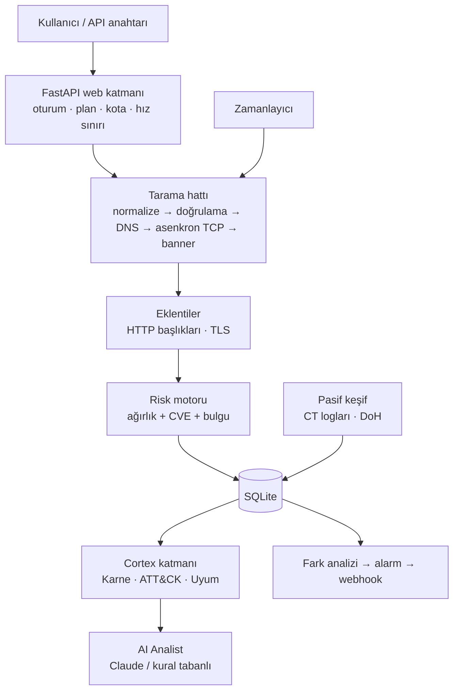

# 🦝 ReconClaw: TÜBİTAK / TEKNOFEST Proje Dosyası

> [!NOTE]
> Bu belge, başvuru formlarına ve jüri sunumuna uyarlanabilecek **taslak içeriktir**. Metni kendi cümlelerinizle düzenleyin. Kategori, takım, danışman ve rapor şablonu şartlarını başvurduğunuz programın **güncel şartnamesinden** kontrol edin. Aşağıda "önerilen deney" olarak geçen ölçümler henüz yapılmamıştır; sonuçları kendi laboratuvarınızda ölçüp ekleyin.

---

## 1. Proje künyesi

| | |
|---|---|
| **Proje adı** | ReconClaw: Yapay Zekâ Destekli Sürekli Saldırı Yüzeyi İzleme ve Risk Analiz Platformu |
| **Alan** | Siber güvenlik · Ağ güvenliği · Yazılım |
| **Ürün türü** | Web tabanlı, çok kullanıcılı, açık kaynak kodlu platform |
| **Sürüm** | v8.0 Cortex |
| **Teknolojiler** | Python 3, FastAPI, asyncio, SQLite, Claude API (`anthropic` SDK), vanilla JavaScript, Docker + Caddy (HTTPS) |
| **Doğrulama** | 88 otomatik test (pytest) |

## 2. Özet

**Türkçe.** Kurumların internete açık servisleri (veritabanları, uzak masaüstü, eski sürümlü sunucular) saldırganların en sık kullandığı giriş noktalarıdır. Mevcut araçlar ya komut satırı bilgisi ve uzman yorumu gerektirir ya da yüksek lisans ücretli ve İngilizcedir. ReconClaw; asenkron TCP taraması, banner tabanlı sürüm tespiti ve CVE imza eşleştirmesiyle bir hedefin dışa açık yüzeyini çıkarır, bulguları **0–100 risk skoru** ve **A+…F güvenlik notuna** dönüştürür, her bulguyu **MITRE ATT&CK** tekniklerine bağlayarak olası saldırı zincirini çizer, **ISO/IEC 27001:2022** ve **KVKK m.12** açısından uyum ön değerlendirmesi yapar ve **AI Analist** ile Türkçe, önceliklendirilmiş bir aksiyon planı üretir. Hedefler **sürekli izlemeye** alınabilir; yeni açılan port veya sürüm değişikliğinde alarm ve webhook bildirimi gönderilir. **Pasif keşif** modülü, hedefe paket göndermeden Sertifika Şeffaflığı loglarından alt alan adlarını ve e-posta güvenliği (SPF / DMARC / CAA) durumunu çıkarır. Platform; hedef sahipliği doğrulama, iç ağ engeli, plan bazlı kotalar ve denetim kaydı gibi kötüye kullanım önlemleriyle yalnızca yetkili kullanım için tasarlanmıştır.

**English.** ReconClaw is a web-based, multi-user attack surface management platform. It discovers exposed services with an asynchronous TCP scanner, fingerprints versions from banners and matches them against known-vulnerable signatures, then turns the findings into a 0–100 risk score and an A+…F security grade. Each finding is mapped to MITRE ATT&CK techniques to derive a plausible kill chain, assessed against ISO/IEC 27001:2022 Annex A and the Turkish Personal Data Protection Law (KVKK, Art. 12), and summarised by an AI analyst (Claude, with a deterministic offline fallback) into a prioritised remediation plan in Turkish. Targets can be continuously monitored with change alerts and webhooks, and a passive reconnaissance module enumerates subdomains from Certificate Transparency logs without sending a single packet to the target.

**Anahtar kelimeler:** saldırı yüzeyi yönetimi, port tarama, MITRE ATT&CK, KVKK, ISO 27001, büyük dil modeli, istem enjeksiyonu, sürekli izleme

## 3. Problem tanımı

1. **Görünürlük eksikliği:** Kurumlar çoğu zaman hangi servislerinin internetten erişilebilir olduğunu bilmez; unutulmuş test sunucuları, dışarıya açık veritabanları ve yamalanmamış servisler fark edilmeden kalır.
2. **Yorumlama boşluğu:** Port tarayıcıların çıktısı (ör. "3306/tcp open") teknik olmayan bir yöneticiye ne yapması gerektiğini söylemez. Bulgunun saldırgan açısından ne anlama geldiği ve hangi mevzuat yükümlülüğünü etkilediği ayrıca uzmanlık ister.
3. **Anlık görüntü sorunu:** Tek seferlik tarama, ertesi gün açılan bir portu yakalamaz; saldırı yüzeyi zamanla değişir.
4. **Erişilebilirlik:** Ticari saldırı yüzeyi yönetimi ürünleri KOBİ'ler ve eğitim kurumları için pahalıdır ve çoğu Türkçe ve KVKK odaklı değildir.

## 4. Amaç ve hedefler

| # | Hedef | Ölçüt (doğrulama yöntemi) |
|---|-------|---------------------------|
| H1 | Dışa açık TCP servislerini hızlı ve hedefi boğmadan tespit etmek | Eşzamanlılık sınırı (semafor, en fazla 300 bağlantı); laboratuvar hedefinde Nmap `-sT` sonucuyla açık port uyumu (**önerilen deney**, bkz. 7.2) |
| H2 | Bulguları anlaşılır bir risk diline çevirmek | 0–100 risk skoru, A+…F not, Türkçe öneri; kuralların birim testleri |
| H3 | Bulguları saldırgan tekniklerine bağlamak | MITRE ATT&CK Enterprise eşlemesi ve saldırı zinciri; deterministik çıktı (aynı girdi → aynı çıktı), testli |
| H4 | Mevzuat ve standart bağlamı sunmak | ISO/IEC 27001:2022 Ek A (8 kontrol) + KVKK m.12 ön değerlendirmesi |
| H5 | Uzman olmayan kullanıcıya aksiyon planı vermek | AI Analist: P1/P2/P3 öncelikli plan; internet yokken kural tabanlı yedek |
| H6 | Değişimi yakalamak | Zamanlanmış tarama + fark analizi + alarm; testte yeni port alarmı üretimi doğrulanır |
| H7 | Kötüye kullanımı zorlaştırmak | Hedef sahipliği doğrulama, iç ağ engeli, kota ve hız sınırı, denetim kaydı, hesap askıya alma |

## 5. Özgün değer ve yenilikçi yönler

1. **Uçtan uca Türkçe zincir:** Keşif → risk skoru → ATT&CK saldırı zinciri → ISO 27001 / KVKK → önceliklendirilmiş aksiyon planı tek bir akışta ve tek bir raporda.
2. **Hibrit analiz mimarisi:** Karne, ATT&CK ve uyum katmanı **deterministik ve testli kurallarla** hesaplanır; büyük dil modeli yalnızca bu yapılandırılmış sonuçları *yorumlar*. Böylece model, skorları veya bulguları uyduramaz; internet olmadığında da sistem kural tabanlı analistle çalışmaya devam eder.
3. **Tarayıcı verisine karşı istem enjeksiyonu farkındalığı:** Banner ve HTTP başlıkları taranan, yani potansiyel olarak saldırgan kontrolündeki sunucudan gelir. Bu veriler modele ayrı bir veri bloğunda ve "güvenilmez veri" etiketiyle verilir; model savunma odaklı bir talimatla sınırlandırılır. Bu, LLM'li güvenlik araçlarında sık gözden kaçan bir saldırı yüzeyidir.
4. **KVKK bağlamı:** Teknik bulgular (ör. dışarıya açık veritabanı) doğrudan KVKK m.12 veri güvenliği yükümlülüğüyle ilişkilendirilir.
5. **Etik tasarım:** Hedef sahipliği DNS TXT kaydı veya doğrulama dosyasıyla kanıtlanabilir; yönetici bu doğrulamayı zorunlu kılabilir.
6. **Sürekli izleme + pasif keşif:** Aktif taramanın yanında, hedefe paket göndermeyen Sertifika Şeffaflığı tabanlı alt alan adı keşfi.

## 6. Yöntem

### 6.1 Mimari

### 6.2 Tarama ve risk skoru

- Her port için `asyncio.open_connection` ile TCP bağlantısı denenir; bir semafor eşzamanlı bağlantıyı 300 ile sınırlar.
- Açık portlardan ilk satır (HTTP'de `Server:` başlığı) okunur ve bilinen zafiyetli sürüm imzalarıyla (vsFTPd 2.3.4, Apache 2.4.49/50, eski OpenSSH vb.) eşleştirilir.
- Hedef risk skoru: `min(100, Σ(servis ağırlığı + CVE ek puanı + eklenti bulgu puanı))`.

### 6.3 Güvenlik karnesi

Beş kategori 0–100 puanlanır ve ağırlıklı ortalama alınır: ağ maruziyeti %30, yama düzeyi %30, şifreleme %20, web sıkılaştırma %10 (yalnızca web servisi varsa), bilgi ifşası %10. Not eşikleri A+ ≥95, A ≥85, B ≥70, C ≥55, D ≥40, F. **Not tavanı:** CVE eşleşmesi varken en fazla D; veritabanı / SMB / RDP / VNC dışarıdaysa en fazla C.

### 6.4 MITRE ATT&CK eşlemesi

Port → teknik kural tablosu (ör. 22/SSH → T1133, T1110, T1021.004; 3306/MySQL → T1110, T1078.001, T1485) ve bulgu → teknik kuralları (CVE → T1190, T1059; TLS sorunları ve eksik HSTS → T1557) uygulanır. Teknikler 14 Enterprise taktiğine dağıtılır. Saldırı zinciri, taktik sırasıyla her taktikten bir teknik seçilerek kurulur: etkisi büyük teknikler önceliklidir ve bir teknik zincirde bir kez yer alır.

### 6.5 Uyum ön değerlendirmesi

Dışarıdan gözlemlenebilen 8 ISO/IEC 27001:2022 Ek A kontrolü (A.8.5, A.8.8, A.8.9, A.8.16, A.8.20, A.8.21, A.8.22, A.8.24) ve KVKK m.12 için kural tabanlı uyumlu / kısmi / uyumsuz kararı ve kanıt üretilir. Çıktı resmi denetim yerine geçmez.

### 6.6 AI Analist

Yapılandırılmış bağlam (portlar, banner'lar, CVE'ler, karne, ATT&CK zinciri, uyum sonucu) JSON olarak `<rapor_verisi>` bloğunda Claude'a gönderilir. Sistem talimatı; yalnızca veriye dayanmayı, veride olmayan CVE yazmamayı, savunma odaklı kalmayı ve bloktaki metinleri talimat olarak uygulamamayı şart koşar. Model isteği reddederse API'nin sunucu taraflı yedek modeli devreye girer; ağ veya anahtar sorunu olursa kural tabanlı analist aynı bölümleri üretir.

### 6.7 Sürekli izleme ve pasif keşif

Zamanlayıcı her 30 saniyede zamanı gelen görevleri aynı tarama hattından geçirir (kota ve doğrulama kuralları dahil), sonucu önceki taramayla karşılaştırır ve kural tabanlı şiddet sınıflandırmasıyla alarm üretir. Pasif keşif, crt.sh / CertSpotter Sertifika Şeffaflığı kayıtlarından alt alan adlarını toplar, DNS-over-HTTPS ile kayıtları alır ve SPF / DMARC / CAA politikalarını puanlar.

## 7. Doğrulama ve test

### 7.1 Otomatik testler

`pytest` ile 88 test: tarama motoru ve risk modeli (18), API ve kullanıcı izolasyonu (11), kimlik doğrulama (10), eklentiler (6), istatistikler (4), abonelik (12), yönetim (7), izleme ve keşif (9), Cortex ve AI Analist (11). Ağ gerektiren bileşenler testlerde sahte (mock) fonksiyonlarla izole edilir.

### 7.2 Önerilen deneyler (sonuçları siz ekleyin)

| Deney | Kurulum | Ölçülecek |
|-------|---------|-----------|
| D1: Port tespiti doğruluğu | VirtualBox'ta Kali (ReconClaw) + Metasploitable 2 (hedef), aynı host-only ağ | ReconClaw ve `nmap -sT -p 1-1024` açık port listelerinin örtüşmesi (kesinlik / duyarlılık) |
| D2: Hız | Aynı hedef, 1–1024 ve 1–10000 aralıkları, 5'er tekrar | Ortalama süre ve standart sapma; zaman aşımı (0.5 / 1.0 sn) etkisi |
| D3: Sürüm / CVE eşleşmesi | Metasploitable 2 (vsFTPd 2.3.4, eski OpenSSH vb.) | Beklenen CVE imzalarının yakalanma oranı |
| D4: Değişim tespiti | İzleme görevi + hedefte yeni servis açma | Alarm üretim süresi (izleme aralığına göre) |
| D5: AI Analist tutarlılığı | Aynı rapor için 5 değerlendirme | Aksiyon planındaki P1 maddelerinin kural tabanlı analistle örtüşmesi; veride olmayan CVE üretilip üretilmediği |

## 8. İş-zaman planı (örnek)

| İş paketi | İçerik | Süre |
|-----------|--------|------|
| İP1 | Literatür ve mevcut araç incelemesi (Nmap, CT logları, ATT&CK, ISO 27001, KVKK) | 1. ay |
| İP2 | Tarama motoru, risk modeli, web arayüzü | 2.–3. ay |
| İP3 | Çok kullanıcılı yapı, güvenlik önlemleri, abonelik ve yönetim | 4. ay |
| İP4 | Cortex katmanı: karne, ATT&CK, uyum | 5. ay |
| İP5 | AI Analist, sürekli izleme, pasif keşif | 6. ay |
| İP6 | Deneyler (D1–D5), raporlama, sunum ve yayın | 7.–8. ay |

## 9. Risk yönetimi (B planı)

| Risk | Olasılık | Önlem / B planı |
|------|:--------:|-----------------|
| Sunum sırasında internet yok | Orta | Kural tabanlı analist ve yerel laboratuvar hedefi; pasif keşif için önceden alınmış kayıt (Keşif geçmişi) |
| Claude API anahtarı / kota sorunu | Düşük | Otomatik kural tabanlı yedek; yanıt önbelleği |
| Hedef sistem taramayı engeller (IDS / güvenlik duvarı) | Orta | Zaman aşımı ve port kapsamı ayarı; laboratuvar ortamı |
| Kötüye kullanım | Orta | Hedef doğrulama zorunluluğu, iç ağ engeli, kota, denetim kaydı, hesap askıya alma |
| Yanlış pozitif CVE eşleşmesi | Orta | İmzalar sürüm bazlı ve dar tutulur; rapor "ön değerlendirme" olarak sunulur |

## 10. Yaygın etki

- **KOBİ ve kamu:** Uzman istihdam edemeyen kurumlara dış saldırı yüzeyini Türkçe ve anlaşılır biçimde gösterme.
- **Eğitim:** Siber güvenlik derslerinde ATT&CK ve uyum kavramlarını somut çıktıyla öğretme.
- **Ticarileşme:** Abonelik modeli (Free → Ultra Max) ve yönetim paneli, ürünü SaaS olarak sunmaya hazırdır; gerçek ödeme altyapısı (iyzico) entegrasyonu yol haritasındadır.
- **Açık kaynak:** Kural tabloları ve eklenti sistemi topluluk katkısına açıktır.

## 11. Etik ve yasal çerçeve

İzinsiz port taraması Türkiye'de TCK 243–245 kapsamında suç teşkil edebilir. ReconClaw yalnızca sahibi olunan veya yazılı izin alınan sistemlerde kullanılmalıdır. Platform bu ilkeyi teknik olarak destekler: hedef sahipliği doğrulama (`REQUIRE_TARGET_VERIFICATION`), iç ağ taramasını kapatma (`ALLOW_PRIVATE_TARGETS`), kayıtları kapatma, denetim kaydı ve hesap askıya alma. Demo ve deneyler için Nmap'in resmi test sunucusu `scanme.nmap.org` ile kendi sanal laboratuvarınız kullanılmalıdır.

## 12. Demo kontrol listesi (sunumdan önce)

- [ ] `git pull` ve `pip install -r requirements.txt`; `python main.py` sorunsuz açılıyor
- [ ] Yönetici hesabı hazır (`python manage.py make-admin ...`), plan rozetinde **ADMIN** yazıyor
- [ ] Metasploitable 2 sanal makinesi açık ve Kali'den erişilebilir (internetsiz sunum için)
- [ ] En az bir tarama, bir izleme görevi (alarmlı) ve bir pasif keşif kaydı önceden hazır
- [ ] `.env` içinde `ANTHROPIC_API_KEY` varsa bir AI değerlendirmesi önceden üretilmiş (önbellekten anında açılır)
- [ ] Paylaşım bağlantısı telefonda açılıyor (aynı ağda `HOST=0.0.0.0` ile)
- [ ] Tarayıcıda **Ctrl+Shift+R**, tam ekran (F11), yakınlaştırma %100

## 13. Jüriden beklenebilecek sorular

| Soru | Kısa yanıt |
|------|------------|
| Nmap / Shodan'dan farkı ne? | Onların yerini almaz; tespitin üzerine risk, ATT&CK, uyum, AI destekli aksiyon planı, sürekli izleme ve çok kullanıcılı raporlama katmanı ekler. Türkçe ve KVKK odaklıdır. |
| Yapay zekâ yanlış bilgi verirse? | Skor, not, ATT&CK ve uyum deterministik kurallarla hesaplanır; model yalnızca yorumlar ve veride olmayan CVE yazmamakla sınırlandırılmıştır. Model devre dışıyken de sistem çalışır. |
| Banner'a kötü niyetli talimat yazılırsa? | Banner'lar modele ayrı veri bloğunda "güvenilmez veri" olarak verilir; sistem talimatı bu metinlerin uygulanmasını yasaklar (istem enjeksiyonu önlemi). |
| Neden ATT&CK? | Bulguyu "hangi saldırı adımını mümkün kılıyor" sorusuyla ilişkilendiren, sektörde ortak kabul görmüş bir dil sağladığı için. |
| Uyum çıktısı resmi mi? | Hayır; dışarıdan gözlemlenebilen bulgulara dayalı ön değerlendirmedir, denetime hazırlık için yol gösterir. |
| Ölçeklenebilirlik? | Tarama asenkron ve eşzamanlılığı sınırlı; veritabanı katmanı SQLite ile başlar, şema PostgreSQL'e taşınabilir. Docker + Caddy ile HTTPS yayını hazırdır. |
| Kötüye kullanımı nasıl önlüyorsunuz? | Sahiplik doğrulama, iç ağ engeli, plan bazlı kota ve hız sınırı, denetim kaydı, yönetici tarafından askıya alma. |
