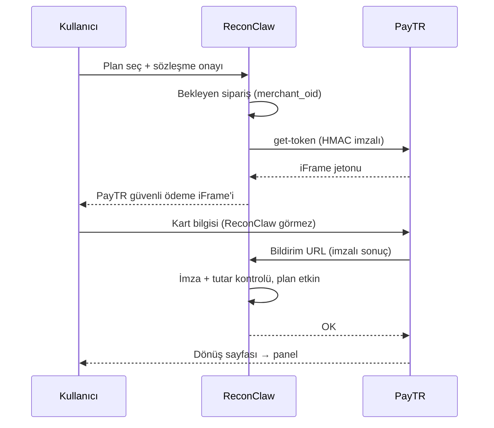

# ReconClaw — Canlı Yayın ve PayTR Kurulum Rehberi

Bu rehber, ReconClaw'ı **https://reconclaw.com.tr** gibi bir alan adında güvenli şekilde yayınlamak ve
**PayTR** ile gerçek ödeme almak için gereken her adımı sırasıyla anlatır.

---

## 1. Yayın kontrol listesi

Sunucudaki `.env` dosyasında şunların ayarlı olduğundan emin olun (`cp .env.example .env`):

| Ayar | Değer | Neden |
|------|-------|-------|
| `DOMAIN` | `reconclaw.com.tr` | Caddy bu ad için SSL sertifikası alır |
| `PUBLIC_URL` | `https://reconclaw.com.tr` | OAuth, PayTR dönüş adresleri, e-posta bağlantıları ve CSRF kontrolü bununla üretilir |
| `COOKIE_SECURE` | `true` (PUBLIC_URL https ise otomatik) | Oturum çerezi yalnızca HTTPS'te gider |
| `ALLOW_PRIVATE_TARGETS` | `false` | **Mutlaka.** Aksi halde ziyaretçiler sunucunuzun iç ağını tarayabilir |
| `REQUIRE_TARGET_VERIFICATION` | `true` | **Mutlaka.** Kullanıcılar yalnızca sahipliğini kanıtladığı alan adlarını tarar (izinsiz tarama TCK 243'e girer) |
| `TURNSTILE_SITE_KEY` / `TURNSTILE_SECRET_KEY` | Cloudflare'den | Kayıt / giriş / şifre sıfırlamada bot koruması |
| `TRUST_COUNTRY_HEADER`, `TRUST_PROXY_IP` | `true` (yalnızca Cloudflare arkasında) | Ülke (TL/EUR) ve gerçek IP Cloudflare başlıklarından alınır |
| `COMPANY_*` | Vergi levhanızdaki bilgiler | Yasal sayfalar ve iletişim sayfası bunlarla dolar |
| `SMTP_*` | E-posta servisiniz | "Şifremi unuttum" için |
| `PAYTR_*` | PayTR panelinden | Gerçek ödeme (aşağıda) |

Değişiklikten sonra: `docker compose up -d --build`

### Kontrol

- `https://reconclaw.com.tr/api/health` → `"private_targets": false, "target_verification": true` olmalı
- `https://reconclaw.com.tr/yasal/mesafeli-satis` → sarı **(belirtilecek)** yazısı kalmamalı (hepsi `COMPANY_*` ile dolmalı)
- `https://reconclaw.com.tr/fiyatlandirma`, `/iletisim`, `/robots.txt`, `/.well-known/security.txt` açılmalı
- [securityheaders.com](https://securityheaders.com) ve [SSL Labs](https://www.ssllabs.com/ssltest/) ile test edin (A / A+ beklenir)

### Sosyal giriş (OAuth)

Alan adı değiştiği için her sağlayıcının panelinde yönlendirme adresini güncelleyin:
`https://reconclaw.com.tr/auth/google/callback` (github, microsoft, apple için de aynı biçim).

---

## 2. Cloudflare (önerilir)

1. Alan adını Cloudflare'e ekleyin, `.com.tr` kayıt firmanızda nameserver'ları Cloudflare'inkilerle değiştirin.
2. DNS: `A  reconclaw.com.tr → sunucu IP` ve `CNAME www → reconclaw.com.tr`, ikisi de **turuncu bulut (Proxied)**.
3. **SSL/TLS → Full (strict)**. (Flexible kullanmayın; yönlendirme döngüsüne ve güvensiz bağlantıya yol açar.)
4. **Security → Bots → Bot Fight Mode** açık; **WAF → Rate limiting**: `/auth/*` için dakikada 20 istek.
5. Turnstile: **Turnstile → Add widget**, alan adı `reconclaw.com.tr`, anahtarları `.env`'e yazın.
6. `.env`: `TRUST_COUNTRY_HEADER=true`, `TRUST_PROXY_IP=true`.
7. **Önemli:** sunucunun 80/443 portlarını yalnızca [Cloudflare IP aralıklarına](https://www.cloudflare.com/ips/) açın
   (ör. `ufw`). Aksi halde biri sunucuya doğrudan bağlanıp `CF-Connecting-IP` başlığını sahteleyebilir.
8. **PayTR bildirim adresi Cloudflare'e takılmamalı:** WAF → Custom rules → `URI Path equals /odeme/paytr/bildirim`
   için **Skip** (Bot Fight Mode / challenge uygulanmasın). Aksi halde PayTR'nin sunucusu "robot" sanılıp engellenir ve
   ödeme alınsa bile plan açılmaz.

---

## 3. PayTR ile gerçek ödeme

### 3.1 Başvurudan önce gerekenler

PayTR (ve tüm sanal POS sağlayıcıları) bireysel kişiye değil **vergi mükellefine** hizmet verir:

- **Şirket:** Şahıs şirketi yeterlidir (vergi dairesinden açılış, birkaç gün). Yazılım/SaaS için genelde
  NACE 62.01 "Bilgisayar programlama faaliyetleri". 18 yaş altıysanız şirket bir veliniz adına açılabilir.
  Genç girişimci istisnası (29 yaş altı, ilk 3 yıl gelir vergisi istisnası) için muhasebecinize danışın.
- **Banka hesabı:** şirket adına TL hesabı + EUR hesabı (yurt dışı ödemeler EUR geldiği için).
- **Sitede yayında olması gerekenler** (PayTR inceleme ekibi siteye bakar) — hepsi ReconClaw'da hazır, sadece
  `COMPANY_*` alanlarını doldurmanız gerekir:
  - Mesafeli Satış Sözleşmesi → `/yasal/mesafeli-satis`
  - Ön Bilgilendirme Formu → `/yasal/on-bilgilendirme`
  - İptal ve İade Koşulları → `/yasal/iade`
  - KVKK Aydınlatma Metni ve Gizlilik → `/yasal/kvkk`, `/yasal/gizlilik`
  - İletişim (unvan, adres, telefon, e-posta, vergi no) → `/iletisim`
  - Ürün/fiyat listesi → `/fiyatlandirma`
- **E-arşiv fatura:** Her ödeme için fatura kesmeniz gerekir. GİB e-Arşiv Portal (ücretsiz, elle) veya
  Paraşüt / BizimHesap / Logo gibi bir servis kullanın. Yurt dışı (EUR) satışlar hizmet ihracatı sayılabilir; KDV
  durumunu muhasebecinizle netleştirin.

### 3.2 Başvuru

1. <https://www.paytr.com> → **Başvuru** → "Online Ödeme / iFrame API". Site adresi: `https://reconclaw.com.tr`.
2. Faaliyet: "Yazılım / SaaS abonelik". Ürün teslimi: dijital, anında.
3. İstenen belgeler (genelde): vergi levhası, kimlik, imza beyannamesi (şahıs şirketinde), IBAN.
4. Yabancı kartlardan EUR almak için **döviz ile ödeme** özelliğini ayrıca talep edin.

### 3.3 Mağaza paneli ayarları

Onaydan sonra **PayTR Mağaza Paneli**:

1. **Destek & Kurulum → Entegrasyon Bilgileri**: `Mağaza No`, `Mağaza Parola (merchant_key)`,
   `Mağaza Gizli Anahtar (merchant_salt)` değerlerini alın.
2. **Destek & Kurulum → Ayarlar → Bildirim URL**:

   ```
   https://reconclaw.com.tr/odeme/paytr/bildirim
   ```

   Bu adres planı açan TEK yerdir. PayTR ödeme sonucunu sunucudan sunucuya buraya gönderir; ReconClaw imzayı
   doğrular, tutarı kontrol eder, planı açar ve `OK` yanıtı verir.
3. `.env`:

   ```ini
   PAYTR_MERCHANT_ID=123456
   PAYTR_MERCHANT_KEY=xxxxxxxxxxxxxxxx
   PAYTR_MERCHANT_SALT=xxxxxxxxxxxxxxxx
   PAYTR_TEST_MODE=true
   ```

   ve `docker compose up -d`. Üç değer de doluysa demo ödeme otomatik kapanır, "ÖDEMEYE GEÇ" butonu PayTR'yi açar.

> [!CAUTION]
> `PAYTR_MERCHANT_KEY` ve `PAYTR_MERCHANT_SALT` ile sahte "ödendi" bildirimi üretilebilir. Yalnızca sunucudaki
> `.env`'de tutun; GitHub'a, ekran görüntüsüne veya mesaja koymayın. Sızarsa panelden hemen yenileyin.

### 3.4 Test

1. `PAYTR_TEST_MODE=true` iken yeni açtığınız normal bir hesapla Abonelik → Pro → sözleşme onayı → **ÖDEMEYE GEÇ**.
2. PayTR'nin test kartlarını kullanın (Mağaza Paneli → Destek & Kurulum → Test Kartları; ör. `4355 0843 5508 4358`,
   son kullanma ileri bir tarih, CVV `000`).
3. Birkaç saniye sonra plan "Pro" olmalı; Abonelik sayfasındaki ödeme geçmişinde durum **ÖDENDİ**.
4. Plan açılmadıysa: PayTR Paneli → **İşlemler → Bildirim Hataları** (Bildirim URL'ye ulaşılamıyor mu? Cloudflare
   engelliyor mu? — bkz. 2.8) ve sunucu kaydı: `docker compose logs reconclaw | grep -i paytr`.

### 3.5 Canlıya geçiş

PayTR test işlemlerinizi görüp mağazayı canlıya aldığında:

```ini
PAYTR_TEST_MODE=false
```

ve `docker compose up -d`. Canlı modda test bildirimleri plan açmaz.

### 3.6 Nasıl çalışır (özet)



- Abonelik **otomatik yenilenmez** (tek çekim). Süre bitmeden aynı plan tekrar alınırsa yeni süre kalan sürenin
  üstüne eklenir. Otomatik yenileme (kart saklama / tekrarlayan ödeme) PayTR'de ayrı onay gerektirir.
- Türkiye'den gelenler **TL**, yurt dışındakiler **EUR** öder (IP'ye göre). Fiyatlar sunucuda hesaplanır;
  tarayıcıdan gelen tutara güvenilmez.
- Aynı bildirim birden fazla gelirse plan yalnızca bir kez uzatılır; eksik tutarlı bildirim reddedilir.

---

## 4. Yedekleme

Tüm veriler `reconclaw-data` Docker biriminde tek bir SQLite dosyasıdır. Günlük yedek (crontab):

```bash
0 4 * * * docker compose -f /root/ReconClaw/docker-compose.yml exec -T reconclaw \
  python -c "import sqlite3; s=sqlite3.connect('/app/data/reconclaw.db'); s.backup(sqlite3.connect('/app/data/yedek.db'))" \
  && docker cp $(docker compose -f /root/ReconClaw/docker-compose.yml ps -q reconclaw):/app/data/yedek.db /root/yedek/reconclaw-$(date +\%F).db
```

Yedekleri sunucu dışına da kopyalayın (ör. haftalık olarak bilgisayarınıza). Ödeme kayıtları fatura için gereklidir.

---

## 5. Hukuki notlar

- Yasal metinler genel şablondur; şirketinizin durumuna göre bir avukat / mali müşavire kontrol ettirin.
- **VERBİS:** Yıllık çalışan sayısı 50'den az ve mali bilanço toplamı 100 milyon TL'den az olan veri sorumluları kayıttan
  muaftır (güncel eşiği KVKK sitesinden kontrol edin).
- **ETBİS:** E-ticaret yapan işletmeler Ticaret Bakanlığı ETBİS'e kayıt olmalıdır (<https://www.eticaret.gov.tr>).
- Siber güvenlik aracı sattığınız için Kullanım Şartları'ndaki "yalnızca izinli hedefler" maddesi ve
  `REQUIRE_TARGET_VERIFICATION=true` sizi korur; kötüye kullanım şikâyetinde denetim kayıtları delil olur.
